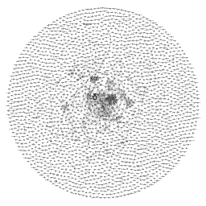

<p align="center">
  <a href="http://www.doi.org/10.5281/zenodo.2531632">
    
  </a>
  <a href="mailto:torsten.timm@kereti.de">
    
  </a>
  <a href="https://github.com/TorstenTimm/TestText/blob/master/LICENSE">
    
  </a>
</p>

# <p align='center'>Self-citation text generator: Additional materials</p>

#### Table of Contents

<details>
<summary>Click to open</summary>

**[About](#about)**<br>
**[1. Network graphs](#network-graphs)**<br>
[1.1. Graphs for the whole VMS, pages in Currier A and B](#general-graphs)<br>
[1.2. Graphs by illustration](#illustration-graphs)<br>
[1.3. Graphs for individual pages](#page-graphs)<br>
[1.4. Example 1: graph for page f2v](#page-example)<br>
[1.5. Example 2: graph for page f52r](#page-example2)<br>
[1.6. Graph for a Vietnamese text](#vietnamese-graph)<br>
[1.7. Graph for a Greek text](#greek-graph)<br>
[1.8. Graph for a Arabic text](#arabic-graph)<br>
[1.9. Gephi project files](#gephi)<br>
**[2. Self-citation text generator](#self-citation-text-generator)**<br>
[2.1. Executable](#executable)<br>
[2.2. Analyzed text](#generated-text)<br>
[2.3. Source code](#source-code)<br>
[2.4. App for iOS](#ios-app)<br>
</details>

<a name="about"></a><a name="0."></a>
## About

This repository contains additional materials to the paper "<a href="https://doi.org/10.1080/01611194.2019.1596999">A possible generating algorithm of the Voynich Manuscript</a>" by <a href="https://independent.academia.edu/TorstenTimm">Torsten Timm</a> and <a href="https://www.jku.at/linz-school-of-education/ueber-uns/team/mint/schinner-andreas/">Andreas Schinner</a>.

The <a href="https://en.wikipedia.org/wiki/Voynich_manuscript">Voynich Manuscript</a> (VMS) is a mysterious medieval manuscript. It contains a text in an unknown script. The modern history of the medieval manuscript starts in 1912, when the Polish-born bookseller <a href="https://en.wikipedia.org/wiki/Wilfrid_Voynich">Wilfrid Voynich</a> bought it from a <a href="https://en.wikipedia.org/wiki/Villa_Mondragone">Jesuit college</a> in Italy. Since its discovery in 1912 the manuscript has attracted the attention of numerous researchers. Although the text reveals numerous semantic patterns, no one has been able to read it or to decipher the script in the last hundred years.

<a name="network-graphs"></a><a name="1."></a>
## 1. Network graphs

<a name="general-graphs"></a><a name="1.1."></a>
### [1.1.](#general-graphs) Graphs for the whole VMS, pages in Currier A and B

  A useful method to analyze the similarity relations between words of a VMS (sub-)section is their representation as nodes in a graph. An edge indicates in the following graphs that two words differ by just one glyph.

  To highlight words similar to &lt;&gt;, &lt;&gt;, and &lt;&gt; different colors are used. All nodes for a word that contains the glyph &lt;i&gt; are orange. Nodes of a word ending in &lt;d&gt; or &lt;y&gt; are purple. Nodes of words containing &lt;ol&gt;, &lt;or&gt;, &lt;ar&gt;, &lt;al&gt;, or ending with &lt;am&gt; or &lt;os&gt; are green. All other nodes are in blue color. The size of a node is determined by the number of times a token appears in the VMS.

  - #### Graph illustrating the whole VMS &nbsp;&nbsp;-&nbsp;&nbsp; [VoynichAll.png](graphs/VoynichAll/VoynichAll.png) &nbsp;/&nbsp; [VoynichAll.pdf](graphs/VoynichAll/VoynichAll.pdf)

  The graph of the whole VMS shows one giant network connecting all frequently used word types.

  [](graphs/VoynichAll/VoynichAll.png)

  - #### Graph of pages in Currier A &nbsp;&nbsp;-&nbsp;&nbsp; [CurrierA.png](graphs/VoynichAll/CurrierA.png) &nbsp;/&nbsp; [CurrierA.pdf](graphs/VoynichAll/CurrierA.pdf)

  The graph for Currier A shows also one giant network. Typical are <a href="http://www.voynichese.com/#/exa:daiin:coral/exa:dain:puce/exa:saiin:salmon/exa:chor:forest-green/exa:chol:chartreuse/exa:shor:teal/exa:shol:lime/exa:chy:plum/exa:cthy:lavender/exa:shy:mauve/exa:sho:puce/0">word types similar</a> to &lt;daiin&gt;/&lt;dain&gt;, &lt;chol&gt;/&lt;chor&gt;, or &lt;chy&gt;/&lt;cthy&gt;.

  [](graphs/VoynichAll/CurrierA.png)

  - #### Graph of pages in Currier B &nbsp;&nbsp;-&nbsp;&nbsp; [CurrierB.png](graphs/VoynichAll/CurrierB.png) &nbsp;/&nbsp; [CurrierB.pdf](graphs/VoynichAll/CurrierB.pdf)

  The graph for Currier B shows also one giant network. Typical are <a href="http://www.voynichese.com/#/exa:chedy:plum/exa:shedy:lavender/exa:cheedy:indigo/exa:sheedy:mauve/exa:daiin:coral/exa:aiin:puce/exa:qokeedy:azure/exa:qokedy:cyan/exa:qokeey:medium-blue/exa:qokain:crimson/exa:qokaiin:maroon/1228">word types similar</a> to &lt;chedy&gt;/&lt;shedy&gt;, &lt;ol&gt;/&lt;ar&gt;, &lt;daiin&gt;/&lt;aiin&gt;, or types starting with &lt;qo-&gt; like &lt;qokeedy&gt;/&lt;qokedy&gt;/&lt;qokeey&gt; or &lt;qokain&gt;/&lt;qokaiin&gt;.

  [](graphs/VoynichAll/CurrierB.png)

  - #### Words preferred in Currier A and B &nbsp;&nbsp;-&nbsp;&nbsp; [CurrierAvsB.png](graphs/VoynichAll/CurrierAvsB.png) &nbsp;/&nbsp; [CurrierAvsB.pdf](graphs/VoynichAll/CurrierAvsB.pdf)

  The following graph demonstrates that the word types typical for  and  are connected with each other. Nodes of words preferred in Currier A are red and nodes preferred in Currier B are green. Words typical for Curier A and B are .

  For instance, the type &lt;chey&gt; is frequently used in Currier A as well as in Currier B. Moreover, &lt;chey&gt; <a href="http://www.voynichese.com/#/exa:chey:crimson/exa:chy:plum/exa:cho:lavender/f20v/0">is similar</a> to types occurring in Currier A like &lt;chy&gt; and &lt;cho&gt;. It is <a href="http://www.voynichese.com/#/exa:chey:crimson/exa:chedy:plum/exa:shedy:lavender/f111v/1228">as well similar</a> to types typical for Currier B like &lt;chedy&gt; and &lt;shedy&gt;. Moreover, &lt;chey&gt; occurs in Currier A in close vicinity to similar tokens as &lt;shey&gt; and &lt;chy&gt; and in Currier B in close vicinity to tokens as &lt;chedy&gt; and &lt;shey&gt;. More details about &lt;chey&gt; and &lt;chedy&gt; are given in [chey_chedy.md](chey_chedy.md).

  [](graphs/VoynichAll/CurrierAvsB.png)

<a name="illustration-graphs"></a><a name="1.2."></a>
### [1.2.](#illustration-graphs) Graphs by **illustration**
  - 01 Herbal section in Currier A &nbsp;&nbsp;&nbsp;&nbsp;&nbsp;&nbsp;&nbsp;&nbsp;&nbsp;&nbsp;&nbsp;&nbsp;&nbsp;&nbsp;&nbsp;&nbsp;&nbsp;-&nbsp;&nbsp; [01herbalA.png](graphs/VoynichIllustration/01herbalA.png) &nbsp;/&nbsp; [01herbalA.pdf](graphs/VoynichIllustration/01herbalA.pdf)
  - 02 Pharmaceutical section in Currier A &nbsp;&nbsp;-&nbsp;&nbsp; [02pharma.png](graphs/VoynichIllustration/02pharma.png) &nbsp;/&nbsp; [02pharma.pdf](graphs/VoynichIllustration/02pharma.pdf)
  - 03 Astronomical section &nbsp;&nbsp;&nbsp;&nbsp;&nbsp;&nbsp;&nbsp;&nbsp;&nbsp;&nbsp;&nbsp;&nbsp;&nbsp;&nbsp;&nbsp;&nbsp;&nbsp;&nbsp;&nbsp;&nbsp;&nbsp;&nbsp;&nbsp;&nbsp;&nbsp;&nbsp;-&nbsp;&nbsp; [03astro.png](graphs/VoynichIllustration/03astro.png) &nbsp;&nbsp;&nbsp;&nbsp;&nbsp;/&nbsp; [03astro.pdf](graphs/VoynichIllustration/03astro.pdf)
  - 04 Cosmological section &nbsp;&nbsp;&nbsp;&nbsp;&nbsp;&nbsp;&nbsp;&nbsp;&nbsp;&nbsp;&nbsp;&nbsp;&nbsp;&nbsp;&nbsp;&nbsp;&nbsp;&nbsp;&nbsp;&nbsp;&nbsp;&nbsp;&nbsp;&nbsp;&nbsp;-&nbsp;&nbsp; [04cosmo.png](graphs/VoynichIllustration/04cosmo.png) &nbsp;&nbsp;&nbsp;/&nbsp; [04cosmo.pdf](graphs/VoynichIllustration/04cosmo.pdf)
  - 05 Herbal section in Currier B &nbsp;&nbsp;&nbsp;&nbsp;&nbsp;&nbsp;&nbsp;&nbsp;&nbsp;&nbsp;&nbsp;&nbsp;&nbsp;&nbsp;&nbsp;&nbsp;&nbsp;-&nbsp;&nbsp; [05herbalB.png](graphs/VoynichIllustration/05herbalB.png) &nbsp;/&nbsp; [05herbalB.pdf](graphs/VoynichIllustration/05herbalB.pdf)
  - 06 Stars section in Currier B &nbsp;&nbsp;&nbsp;&nbsp;&nbsp;&nbsp;&nbsp;&nbsp;&nbsp;&nbsp;&nbsp;&nbsp;&nbsp;&nbsp;&nbsp;&nbsp;&nbsp;&nbsp;&nbsp;-&nbsp;&nbsp; [06stars.png](graphs/VoynichIllustration/06stars.png) &nbsp;&nbsp;&nbsp;&nbsp;&nbsp;&nbsp;/&nbsp; [06stars.pdf](graphs/VoynichIllustration/06stars.pdf)
  - 07 Biological section in Currier B &nbsp;&nbsp;&nbsp;&nbsp;&nbsp;&nbsp;&nbsp;&nbsp;&nbsp;&nbsp;&nbsp;&nbsp;-&nbsp;&nbsp; [07bio.png](graphs/VoynichIllustration/07bio.png) &nbsp;&nbsp;&nbsp;&nbsp;&nbsp;&nbsp;&nbsp;&nbsp;&nbsp;/&nbsp; [07bio.pdf](graphs/VoynichIllustration/07bio.pdf)

<a name="page-graphs"></a><a name="1.3."></a>
### [1.3.](#page-graphs) Graphs for individual **pages**

  The files are sorted into subfolders. There is a subfolder for each quire of the VMS.

  Common words are highlighted on the relevant page by referring to <a href="http://www.voynichese.com/">voynichese.com</a>. The highlighted word tokens illustrate the fact that tokens with high structural similarity appear preferably in close vicinity of each other.

  <details>
  <summary>Quire 01</summary>

  - <a href="https://www.jasondavies.com/voynich/#f1r/">f1r</a> - [graph](graphs/VoynichQuire/quire01/f1r.png) - voynichese.com:<a href="http://www.voynichese.com/#/exa:daiin:coral/exa:dain:puce/f1r/0">&lt;daiin&gt;/&lt;dain&gt;</a> <a href="http://www.voynichese.com/#/exa:chor:forest-green/exa:chol:chartreuse/exa:shol:lime/f1r/0">&lt;chol&gt;/&lt;chor&gt;/&lt;shol&gt;</a><br>
  - f1v - [graph](graphs/VoynichQuire/quire01/f1v.png) - voynichese.com:<a href="http://www.voynichese.com/#/exa:chol:forest-green/exa:shol:chartreuse/f1v/0">&lt;chol&gt;/&lt;shol&gt;</a> <a href="http://www.voynichese.com/#/exa:dol:forest-green/exa:dal:chartreuse/exa:dar:teal/f1v/0">&lt;dol&gt;/&lt;dal&gt;/&lt;dar&gt;</a><br>
  - f2r - [graph](graphs/VoynichQuire/quire01/f2r.png) - voynichese.com:<a href="http://www.voynichese.com/#/exa:daiin:coral/exa:saiin:puce/f2r/0">&lt;saiin&gt;/&lt;daiin&gt;</a> <a href="http://www.voynichese.com/#/exa:chor:forest-green/exa:chol:chartreuse/exa:shor:teal/exa:shol:olive/f2r/0">&lt;chol&gt;/&lt;shol&gt;/&lt;shor&gt;</a> <a href="http://www.voynichese.com/#/exa:chy:salmon/exa:cthy:plum/exa:cthey:puce/f2r/0">&lt;chy&gt;/&lt;cthy&gt;/&lt;cthey&gt;</a><br>
  - f2v- [graph](graphs/VoynichQuire/quire01/f2v.png) - voynichese.com:<a href="http://www.voynichese.com/#/exa:chor:forest-green/exa:chol:chartreuse/exa:cheol:lime/exa:cheor:teal/f2v/0">&lt;chol&gt;/&lt;chor&gt;/&lt;cheol&gt;</a><br>
  - f3r - [graph](graphs/VoynichQuire/quire01/f3r.png) - voynichese.com:<a href="http://www.voynichese.com/#/exa:chor:forest-green/exa:chol:chartreuse/exa:chal:olive/exa:cham:teal/f3r/0">&lt;chol&gt;/&lt;chor&gt;/&lt;cham&gt;</a><br>
  - f3v - [graph](graphs/VoynichQuire/quire01/f3v.png) - voynichese.com:<a href="http://www.voynichese.com/#/exa:chor:forest-green/exa:chol:chartreuse/exa:chom:aquamarine/exa:tchor:teal/f3v/0">&lt;chor&gt;/&lt;chom&gt;/&lt;tchor&gt;</a><br>
  - f4r - [graph](graphs/VoynichQuire/quire01/f4r.png) - voynichese.com:<a href="http://www.voynichese.com/#/exa:daiin:coral/exa:chaiin:puce/f4r/0">&lt;daiin&gt;/&lt;chaiin&gt;</a> <a href="http://www.voynichese.com/#/exa:chor:forest-green/exa:chol:chartreuse/exa:shor:teal/exa:shol:lime/f4r/0">&lt;shol&gt;/&lt;chol&gt;/&lt;chor&gt;</a><br>
  - f4v - [graph](graphs/VoynichQuire/quire01/f4v.png) - voynichese.com:<a href="http://www.voynichese.com/#/exa:sho:aquamarine/exa:sheo:azure/f4v/0">&lt;sho&gt;/&lt;sheo&gt;</a><br>
  - f5r - [graph](graphs/VoynichQuire/quire01/f5r.png) - voynichese.com:<a href="http://www.voynichese.com/#/exa:cheor:forest-green/exa:chey:salmon/exa:cheo:azure/f5r/0">&lt;cheor&gt;/&lt;cheo&gt;/&lt;chey&gt;</a><br>
  - f5v - [graph](graphs/VoynichQuire/quire01/f5v.png) - voynichese.com:<a href="http://www.voynichese.com/#/exa:chor:forest-green/exa:chol:chartreuse/exa:shol:lime/exa:cthor:teal/f5v/0">&lt;chol&gt;/&lt;chor&gt;/&lt;cthor&gt;</a><br>
  - f6r - [graph](graphs/VoynichQuire/quire01/f6r.png) - voynichese.com:<a href="http://www.voynichese.com/#/exa:chor:forest-green/exa:shol:olive/exa:chol:chartreuse/exa:shor:teal/f6r/0">&lt;chor&gt;/&lt;shol&gt;/&lt;chol&gt;</a><br>
  - f6v - [graph](graphs/VoynichQuire/quire01/f6v.png) - voynichese.com:<a href="http://www.voynichese.com/#/exa:chor:forest-green/exa:shol:olive/exa:chol:chartreuse/exa:shor:teal/exa:char:lime/f6v/0">&lt;chor&gt;/&lt;chol&gt;/&lt;char&gt;</a> <a href="http://www.voynichese.com/#/exa:chy:mauve/exa:cthy:plum/exa:ckhy:puce/f6v/0">&lt;cthy&gt;/&lt;ckhy&gt;/&lt;chy&gt;</a><br>
  - f7r - [graph](graphs/VoynichQuire/quire01/f7r.png) - voynichese.com:<a href="http://www.voynichese.com/#/exa:daiin:coral/exa:dain:puce/f7r/0">&lt;daiin&gt;/&lt;dain&gt;</a> <a href="http://www.voynichese.com/#/exa:chor:forest-green/exa:shol:olive/exa:chol:chartreuse/exa:shor:teal/f7r/0">&lt;chol&gt;/&lt;shol&gt;/&lt;chor&gt;</a><br>
  - f7v - [graph](graphs/VoynichQuire/quire01/f7v.png) - voynichese.com:<a href="http://www.voynichese.com/#/exa:dor:forest-green/exa:dol:chartreuse/f7v/0">&lt;dol&gt;/&lt;dor&gt;</a><br>
  - f8r - [graph](graphs/VoynichQuire/quire01/f8r.png) - voynichese.com:<a href="http://www.voynichese.com/#/exa:chor:forest-green/exa:chol:chartreuse/exa:shol:teal/exa:shor:olive/f8r/0">&lt;chor&gt;/&lt;chol&gt;/&lt;shol&gt;</a><br>
  - f8v - [graph](graphs/VoynichQuire/quire01/f8v.png) - voynichese.com:<a href="http://www.voynichese.com/#/exa:chor:forest-green/exa:chol:chartreuse/exa:shor:teal/exa:shol:olive/f8v/0">&lt;chol&gt;/&lt;shol&gt;/&lt;chor&gt;</a> <a href="http://www.voynichese.com/#/exa:chear:forest-green/exa:char:chartreuse/exa:cthar:teal/f8v/0">&lt;chear&gt;/&lt;char&gt;/&lt;cthar&gt;</a> <a href="http://www.voynichese.com/#/exa:daiin:coral/exa:dain:puce/f8v/0">&lt;dain&gt;/&lt;daiin&gt;</a><br>
  </details>

  <details>
  <summary>Quire 02</summary>

  - <a href="https://www.jasondavies.com/voynich/#f9r/">f9r</a> - [graph](graphs/VoynichQuire/quire02/f9r.png) - voynichese.com:<a href="http://www.voynichese.com/#/exa:chor:forest-green/exa:chol:chartreuse/exa:shol:teal/exa:shor:olive/f9r/0">&lt;shor&gt;/&lt;shol&gt;/&lt;chol&gt;</a> <a href="http://www.voynichese.com/#/exa:daiin:puce/exa:aiin:coral/exa:saiin:salmon/exa:odaiin:plum/f9r/0">&lt;daiin&gt;/&lt;aiin&gt;/&lt;saiin&gt;</a> <a href="http://www.voynichese.com/#/exa:cthy:plum/exa:cphy:mauve/exa:cthey:lavender/f9r/0">&lt;cthy&gt;/&lt;cphy&gt;/&lt;cthey&gt;</a><br>
  - f9v - [graph](graphs/VoynichQuire/quire02/f9v.png) - voynichese.com:<a href="http://www.voynichese.com/#/exa:chor:forest-green/exa:chol:chartreuse/exa:cthor:teal/f9v/0">&lt;chor&gt;/&lt;chol&gt;/&lt;cthor&gt;</a> <a href="http://www.voynichese.com/#/exa:daiin:puce/exa:dain:coral/exa:kaiin:salmon/exa:daiiin:puce/exa:daim:golden/f9v/0">&lt;daiin&gt;/&lt;dain&gt;/&lt;kaiin&gt;</a> <a href="http://www.voynichese.com/#/exa:oty:plum/exa:oky:mauve/exa:yky:lavender/exa:opy:puce/f9v/0">&lt;oty&gt;/&lt;oky&gt;/&lt;yky&gt;</a><br>
  - f10r - [graph](graphs/VoynichQuire/quire02/f10r.png) - voynichese.com:<a href="http://www.voynichese.com/#/exa:chor:forest-green/exa:chol:chartreuse/exa:char:teal/exa:shor:olive/f10r/0">&lt;chol&gt;/&lt;chor&gt;/&lt;shor&gt;</a> <a href="http://www.voynichese.com/#/exa:cthy:plum/exa:chy:mauve/exa:cfhy:lavender/exa:ckhy:puce/f10r/0">&lt;cthy&gt;/&lt;chy&gt;/&lt;cfhy&gt;</a><br>
  - f10v - [graph](graphs/VoynichQuire/quire02/f10v.png) - voynichese.com:<a href="http://www.voynichese.com/#/exa:daiin:puce/exa:dain:coral/exa:sain:salmon/f10v/0">&lt;daiin&gt;/&lt;dain&gt;/&lt;sain&gt;</a><br>
  - f11r - [graph](graphs/VoynichQuire/quire02/f11r.png) - voynichese.com:<a href="http://www.voynichese.com/#/exa:cthy:plum/exa:chy:mauve/exa:cfhy:lavender/exa:cphy:puce/f11r/0">&lt;cthy&gt;/&lt;cfhy&gt;/&lt;cphy&gt;</a> <a href="http://www.voynichese.com/#/exa:daiin:puce/exa:dain:coral/exa:dair:salmon/f11r/0">&lt;daiin&gt;/&lt;dain&gt;/&lt;dair&gt;</a><br>
  - f11v - [graph](graphs/VoynichQuire/quire02/f11v.png) - voynichese.com:<a href="http://www.voynichese.com/#/exa:tchy:plum/exa:dchy:mauve/exa:kchy:lavender/exa:tchey:puce/exa:cthey:mauve/exa:ykchy:lavender/f11v/0">&lt;dchy&gt;/&lt;kchy&gt;/&lt;tchy&gt;</a><br>
  - f13r - [graph](graphs/VoynichQuire/quire02/f13r.png) - voynichese.com:<a href="http://www.voynichese.com/#/exa:chol:forest-green/exa:shol:chartreuse/exa:dchol:teal/exa:dchor:olive/f13r/0">&lt;chol&gt;/&lt;shol&gt;/&lt;dchol&gt;</a> <a href="http://www.voynichese.com/#/exa:ykchy:plum/exa:kchy:mauve/exa:okchy:lavender/f13r/0">&lt;ykchy&gt;/&lt;kchy&gt;/&lt;okchy&gt;</a><br>
  - f13v - [graph](graphs/VoynichQuire/quire02/f13v.png) - voynichese.com:<a href="http://www.voynichese.com/#/exa:daiin:puce/exa:dain:coral/f13v/0">&lt;daiin&gt;/&lt;dain&gt;</a> <a href="http://www.voynichese.com/#/exa:otchy:plum/exa:okchy:mauve/exa:qokchy:lavender/exa:okshy:puce/f13v/0">&lt;otchy&gt;/&lt;okchy&gt;/&lt;qokchy&gt;</a><br>
  - f14r - [graph](graphs/VoynichQuire/quire02/f14r.png) - voynichese.com:<a href="http://www.voynichese.com/#/exa:daiin:puce/exa:dain:coral/exa:ydaiin:salmon/exa:ykaiin:salmon/f14r/0">&lt;daiin&gt;/&lt;dain&gt;/&lt;ydaiin&gt;</a> <a href="http://www.voynichese.com/#/exa:chey:plum/exa:chy:mauve/exa:kchy:lavender/exa:tchy:puce/f14r/0">&lt;chey&gt;/&lt;chy&gt;/&lt;kchy&gt;</a><br>
  - f14v - [graph](graphs/VoynichQuire/quire02/f14v.png) - voynichese.com:<a href="http://www.voynichese.com/#/exa:otchy:plum/exa:okchy:mauve/exa:qotchy:lavender/exa:ykchy:puce/exa:dykchy:indigo/exa:dytchy:indigo/f14v/0">&lt;otchy&gt;/&lt;okchy&gt;/&lt;qotchy&gt;</a> <a href="http://www.voynichese.com/#/exa:daiin:puce/f14v/0">&lt;daiin&gt;</a><br>
  - f15r - [graph](graphs/VoynichQuire/quire02/f15r.png) - voynichese.com:<a href="http://www.voynichese.com/#/exa:shey:plum/exa:shy:mauve/exa:sheey:lavender/f15r/0">&lt;shy&gt;/&lt;shey&gt;/&lt;sheey&gt;</a> <a href="http://www.voynichese.com/#/exa:daiin:puce/exa:dain:coral/exa:saiin:salmon/exa:saiiin:salmon/f15r/0">&lt;daiin&gt;/&lt;dain&gt;/&lt;saiin&gt;</a><br>
  - f15v - [graph](graphs/VoynichQuire/quire02/f15v.png) - voynichese.com:<a href="http://www.voynichese.com/#/exa:chor:forest-green/exa:chol:chartreuse/exa:cthor:teal/exa:shol:olive/f15v/0">&lt;chor&gt;/&lt;chol&gt;/&lt;shol&gt;</a> <a href="http://www.voynichese.com/#/exa:daiin:puce/exa:aiin:coral/f15v/0">&lt;daiin&gt;/&lt;aiin&gt;</a><br>
  - f16r - [graph](graphs/VoynichQuire/quire02/f16r.png) - voynichese.com:<a href="http://www.voynichese.com/#/exa:daiin:puce/exa:saiin:coral/exa:aiin:salmon/f16r/0">&lt;daiin&gt;/&lt;saiin&gt;/&lt;aiin&gt;</a> <a href="http://www.voynichese.com/#/exa:opchy:plum/exa:okchy:mauve/exa:kchy:lavender/exa:sokchy:puce/f16r/0">&lt;opchy&gt;/&lt;okchy&gt;/&lt;kchy&gt;</a><br>
  - f16v - [graph](graphs/VoynichQuire/quire02/f16v.png) - voynichese.com:<a href="http://www.voynichese.com/#/exa:chor:forest-green/exa:chol:chartreuse/exa:cthor:teal/f16v/0">&lt;chol&gt;/&lt;chor&gt;/&lt;cthor&gt;</a> <a href="http://www.voynichese.com/#/exa:ykchy:plum/exa:ytchy:mauve/exa:kchy:lavender/exa:chy:puce/f16v/0">&lt;ykchy&gt;/&lt;ytchy&gt;/&lt;kchy&gt;</a><br>
  </details>

  <details>
  <summary>Quire 03</summary>

  - <a href="https://www.jasondavies.com/voynich/#f17r/">f17r</a> - [graph](graphs/VoynichQuire/quire03/f17r.png) - voynichese.com:<a href="http://www.voynichese.com/#/exa:chor:forest-green/exa:chol:chartreuse/exa:shol:teal/exa:shor:olive/f17r/0">&lt;chol&gt;/&lt;chor&gt;/&lt;shol&gt;</a><br>
  - f17v - [graph](graphs/VoynichQuire/quire03/f17v.png) - voynichese.com:<a href="http://www.voynichese.com/#/exa:or:forest-green/exa:ol:chartreuse/f17v/0">&lt;ol&gt;/&lt;or&gt;</a> <a href="http://www.voynichese.com/#/exa:chor:forest-green/exa:chol:chartreuse/exa:cthol:teal/exa:cthor:olive/exa:chom:aquamarine/f17v/0">&lt;chol&gt;/&lt;chor&gt;/&lt;cthol&gt;</a><br>
  - f18r - [graph](graphs/VoynichQuire/quire03/f18r.png) - voynichese.com:<a href="http://www.voynichese.com/#/exa:dar:forest-green/exa:dal:chartreuse/exa:dary:teal/exa:dair:puce/f18r/0">&lt;dar&gt;/&lt;dal&gt;/&lt;dary&gt;</a> <a href="http://www.voynichese.com/#/exa:qokchor:forest-green/exa:qokchol:chartreuse/f18r/0">&lt;qokchol&gt;/&lt;qokchor&gt;</a> <a href="http://www.voynichese.com/#/exa:chor:forest-green/exa:chol:chartreuse/exa:cthol:teal/exa:shor:olive/exa:chom:aquamarine/f18r/0">&lt;chor&gt;/&lt;shor&gt;/&lt;chol&gt;</a><br>
  - f18v - [graph](graphs/VoynichQuire/quire03/f18v.png) - voynichese.com:<a href="http://www.voynichese.com/#/exa:qokchy:plum/exa:qotchy:mauve/exa:qokshy:lavender/exa:okshy:puce/exa:otchy:puce/f18v/0">&lt;qokchy&gt;/&lt;qotchy&gt;/&lt;qokshy&gt;</a><br>
  - f19r - [graph](graphs/VoynichQuire/quire03/f19r.png) - voynichese.com:<a href="http://www.voynichese.com/#/exa:chor:forest-green/exa:chol:chartreuse/exa:kchor:teal/exa:shor:olive/exa:ykchor:lime/exa:ytchor:lime/f19r/0">&lt;chor&gt;/&lt;chol&gt;/&lt;shor&gt;</a> <a href="http://www.voynichese.com/#/exa:tchy:plum/exa:otchy:mauve/exa:qotchy:lavender/exa:qotshy:puce/f19r/0">&lt;tchy&gt;/&lt;otchy&gt;/&lt;qotchy&gt;</a><br>
  - f19v - [graph](graphs/VoynichQuire/quire03/f19v.png) - voynichese.com:<a href="http://www.voynichese.com/#/exa:chor:forest-green/exa:chol:chartreuse/exa:cthol:teal/exa:cthor:olive/f19v/0">&lt;cthor&gt;/&lt;cthol&gt;/&lt;chol&gt;</a> <a href="http://www.voynichese.com/#/exa:daiin:salmon/f19v/0">&lt;daiin&gt;</a><br>
  - f20r - [graph](graphs/VoynichQuire/quire03/f20r.png) - voynichese.com:<a href="http://www.voynichese.com/#/exa:chor:forest-green/exa:chol:chartreuse/exa:shol:teal/exa:ochol:olive/exa:dchor:lime/f20r/0">&lt;chor&gt;/&lt;chol&gt;/&lt;shol&gt;</a><br>
  - f20v - [graph](graphs/VoynichQuire/quire03/f20v.png) - voynichese.com:<a href="http://www.voynichese.com/#/exa:chor:forest-green/exa:chol:chartreuse/exa:shol:teal/exa:cheol:olive/exa:shos:lime/f20v/0">&lt;chol&gt;/&lt;shol&gt;/&lt;chor&gt;</a> <a href="http://www.voynichese.com/#/exa:shy:plum/exa:chy:mauve/exa:cthy:lavender/exa:sho:aquamarine/f20v/0">&lt;sho&gt;/&lt;shy&gt;/&lt;chy&gt;</a><br>
  - f21r - [graph](graphs/VoynichQuire/quire03/f21r.png) - voynichese.com:<a href="http://www.voynichese.com/#/exa:chor:forest-green/exa:chol:chartreuse/exa:shol:teal/exa:cthor:olive/exa:cheor:lime/exa:cheol:lime/f21r/0">&lt;chol&gt;/&lt;chor&gt;/&lt;shol&gt;</a> <a href="http://www.voynichese.com/#/exa:daiin:salmon/exa:saiin:puce/f21r/0">&lt;daiin&gt;/&lt;saiin&gt;</a> <a href="http://www.voynichese.com/#/exa:chy:plum/exa:cthy:mauve/exa:shy:lavender/f21r/0">&lt;chy&gt;/&lt;cthy&gt;/&lt;shy&gt;</a><br>
  - f21v - [graph](graphs/VoynichQuire/quire03/f21v.png) - voynichese.com:<a href="http://www.voynichese.com/#/exa:daiin:salmon/exa:odaiin:puce/f21v/0">&lt;daiin&gt;/&lt;odaiin&gt;</a> <a href="http://www.voynichese.com/#/exa:qokchy:plum/exa:qotchy:mauve/exa:otchy:lavender/f21v/0">&lt;qokchy&gt;/&lt;qotchy&gt;/&lt;otchy&gt;</a> <a href="http://www.voynichese.com/#/exa:chor:forest-green/exa:chol:chartreuse/exa:tchol:teal/exa:lchol:olive/f21v/0">&lt;chol&gt;/&lt;tchol&gt;/&lt;chor&gt;</a><br>
  - f22r - [graph](graphs/VoynichQuire/quire03/f22r.png) - voynichese.com:<a href="http://www.voynichese.com/#/exa:daiin:salmon/exa:dain:coral/exa:odaiin:puce/exa:ydaiin:mauve/f22r/0">&lt;daiin&gt;/&lt;dain&gt;/&lt;odaiin&gt;</a> <a href="http://www.voynichese.com/#/exa:chor:forest-green/exa:dchol:chartreuse/exa:dchor:teal/exa:kchol:olive/f22r/0">&lt;dchor&gt;/&lt;dchol&gt;/&lt;chor&gt;</a><br>
  - f22v - [graph](graphs/VoynichQuire/quire03/f22v.png) - voynichese.com:<a href="http://www.voynichese.com/#/exa:daiin:salmon/exa:saiin:coral/exa:odaiin:puce/exa:otaiin:plum/exa:ytaiin:plum/f22v/0">&lt;daiin&gt;/&lt;saiin&gt;/&lt;odaiin&gt;</a> <a href="http://www.voynichese.com/#/exa:qokchy:plum/exa:qotchy:mauve/exa:otchy:puce/f22v/0">&lt;qotchy&gt;/&lt;qokchy&gt;/&lt;otchy&gt;</a><br>
  - f23r - [graph](graphs/VoynichQuire/quire03/f23r.png) - voynichese.com:<a href="http://www.voynichese.com/#/exa:dar:forest-green/exa:dal:chartreuse/exa:dair:puce/exa:daiir:coral/exa:daiin:salmon/f23r/0">&lt;dal&gt;/&lt;dar&gt;/&lt;dair&gt;</a> <a href="http://www.voynichese.com/#/exa:chor:forest-green/exa:chol:chartreuse/exa:char:teal/exa:chal:olive/f23r/0">&lt;chol&gt;/&lt;chor&gt;/&lt;char&gt;</a><br>
  - f23v - [graph](graphs/VoynichQuire/quire03/f23v.png) - voynichese.com:<a href="http://www.voynichese.com/#/exa:dor:forest-green/exa:dol:chartreuse/exa:dar:teal/exa:dal:olive/exa:ol:lime/exa:or:lime/f23v/0">&lt;dol&gt;/&lt;dor&gt;/&lt;dar&gt;</a> <a href="http://www.voynichese.com/#/exa:daiin:salmon/exa:dain:coral/exa:dair:puce/f23v/0">&lt;daiin&gt;/&lt;dain&gt;/&lt;dair&gt;</a><br>
  - f24r - [graph](graphs/VoynichQuire/quire03/f24r.png) - voynichese.com:<a href="http://www.voynichese.com/#/exa:chor:forest-green/exa:chol:chartreuse/exa:cheol:teal/exa:cheor:olive/exa:char:lime/f24r/0">&lt;chol&gt;/&lt;cheol&gt;/&lt;cheor&gt;</a> <a href="http://www.voynichese.com/#/exa:daiin:salmon/exa:odaiin:coral/exa:odain:puce/f24r/0">&lt;daiin&gt;/&lt;odaiin&gt;/&lt;odain&gt;</a><br>
  - f24v - [graph](graphs/VoynichQuire/quire03/f24v.png) - voynichese.com:<a href="http://www.voynichese.com/#/exa:chor:forest-green/exa:chol:chartreuse/exa:cheor:teal/exa:cheol:olive/exa:shol:lime/exa:sho:aquamarine/f24v/0">&lt;chol&gt;/&lt;chor&gt;/&lt;cheor&gt;</a><br>
  </details>

  <details>
  <summary>Quire 04</summary>

  - <a href="https://www.jasondavies.com/voynich/#f25r/">f25r</a> - [graph](graphs/VoynichQuire/quire04/f25r.png) - voynichese.com:<a href="http://www.voynichese.com/#/exa:chain:salmon/exa:cthain:puce/exa:chaiin:coral/exa:chan:mauve/f25r/0">&lt;cthain&gt;/&lt;chain&gt;/&lt;chaiin&gt;</a> <a href="http://www.voynichese.com/#/exa:daiin:salmon/f25r/0">&lt;daiin&gt;</a><br>
  - f25v - [graph](graphs/VoynichQuire/quire04/f25v.png) - voynichese.com:<a href="http://www.voynichese.com/#/exa:daiin:salmon/f25v/0">&lt;daiin&gt;</a> <a href="http://www.voynichese.com/#/exa:chor:forest-green/exa:chol:chartreuse/exa:shol:teal/exa:kchor:olive/exa:shol:lime/exa:cho:aquamarine/f25v/0">&lt;cho&gt;/&lt;chor&gt;/&lt;chol&gt;</a><br>
  - f26r - [graph](graphs/VoynichQuire/quire04/f26r.png) - voynichese.com:<a href="http://www.voynichese.com/#/exa:qokedy:plum/exa:qokeedy:mauve/exa:okeedy:lavender/exa:okedy:puce/exa:otedy:puce/exa:ytedy:puce/f26r/0">&lt;qokedy&gt;/&lt;qokeedy&gt;/&lt;okeedy&gt;</a> <a href="http://www.voynichese.com/#/exa:daiin:salmon/exa:aiin:puce/exa:saiin:coral/f26r/0">&lt;daiin&gt;/&lt;aiin&gt;/&lt;saiin&gt;</a><br>
  - f26v - [graph](graphs/VoynichQuire/quire04/f26v.png) - voynichese.com:<a href="http://www.voynichese.com/#/exa:qokedy:plum/exa:qotedy:mauve/exa:otedy:lavender/exa:qoteedy:puce/f26v/0">&lt;qokedy&gt;/&lt;qotedy&gt;/&lt;otedy&gt;</a> <a href="http://www.voynichese.com/#/exa:chedy:plum/exa:shedy:mauve/exa:chey:lavender/exa:shdy:puce/f26v/0">&lt;chedy&gt;/&lt;shedy&gt;/&lt;chey&gt;</a><br>
  - f27r - [graph](graphs/VoynichQuire/quire04/f27r.png) - voynichese.com:<a href="http://www.voynichese.com/#/exa:chy:plum/exa:shy:mauve/exa:chey:lavender/exa:shey:puce/f27r/0">&lt;chy&gt;/&lt;shy&gt;/&lt;chey&gt;</a> <a href="http://www.voynichese.com/#/exa:chor:forest-green/exa:chol:chartreuse/exa:shol:teal/exa:chos:olive/f27r/0">&lt;chol&gt;/&lt;chor&gt;/&lt;chos&gt;</a> <a href="http://www.voynichese.com/#/exa:daiin:salmon/exa:dain:puce/exa:daiiin:coral/f27r/0">&lt;daiin&gt;/&lt;dain&gt;/&lt;daiiin&gt;</a><br>
  - f27v - [graph](graphs/VoynichQuire/quire04/f27v.png) - voynichese.com:<a href="http://www.voynichese.com/#/exa:sho:aquamarine/exa:shy:mauve/exa:chy:lavender/exa:dchy:puce/exa:dshy:puce/exa:kchy:plum/f27v/0">&lt;sho&gt;/&lt;shy&gt;/&lt;chy&gt;</a><br>
  - f28r - [graph](graphs/VoynichQuire/quire04/f28r.png) - voynichese.com:<a href="http://www.voynichese.com/#/exa:daiin:salmon/exa:deaiin:puce/f28r/0">&lt;daiin&gt;/&lt;deaiin&gt;</a> <a href="http://www.voynichese.com/#/exa:cthol:forest-green/exa:ctheol:chartreuse/f28r/0">&lt;cthol&gt;/&lt;ctheol&gt;</a> <a href="http://www.voynichese.com/#/exa:otor:forest-green/exa:otol:chartreuse/f28r/0">&lt;otor&gt;/&lt;otol&gt;</a><br>
  - f28v - [graph](graphs/VoynichQuire/quire04/f28v.png) - voynichese.com:<a href="http://www.voynichese.com/#/exa:chor:forest-green/exa:chol:chartreuse/exa:shor:teal/exa:cheor:olive/f28v/0">&lt;chol&gt;/&lt;chor&gt;/&lt;cheor&gt;</a> <a href="http://www.voynichese.com/#/exa:daiin:salmon/exa:dain:puce/exa:daiiin:coral/exa:daiis:mauve/f28v/0">&lt;daiin&gt;/&lt;dain&gt;/&lt;daiiin&gt;</a><br>
  - f29r - [graph](graphs/VoynichQuire/quire04/f29r.png) - voynichese.com:<a href="http://www.voynichese.com/#/exa:shor:forest-green/exa:chol:chartreuse/exa:shos:teal/exa:chos:olive/f29r/0">&lt;shor&gt;/&lt;shos&gt;/&lt;chos&gt;</a> <a href="http://www.voynichese.com/#/exa:qokchy:plum/exa:qotchy:mauve/f29r/0">&lt;qokchy&gt;/&lt;qotchy&gt;</a><br>
  - f29v - [graph](graphs/VoynichQuire/quire04/f29v.png) - voynichese.com:<a href="http://www.voynichese.com/#/exa:chol:chartreuse/exa:cho:aquamarine/exa:sho:aquamarine/exa:shy:plum/exa:chy:puce/f29v/0">&lt;chol&gt;/&lt;cho&gt;/&lt;sho&gt;</a> <a href="http://www.voynichese.com/#/exa:daiin:salmon/exa:dain:puce/exa:odaiin:coral/exa:okaiin:mauve/f29v/0">&lt;daiin&gt;/&lt;odaiin&gt;/&lt;okaiin&gt;</a><br>
  - f30r - [graph](graphs/VoynichQuire/quire04/f30r.png) - voynichese.com:<a href="http://www.voynichese.com/#/exa:chey:plum/exa:shey:mauve/exa:ckhey:puce/exa:rchey:lavender/f30r/0">&lt;chey&gt;/&lt;shey&gt;/&lt;ckhey&gt;</a> <a href="http://www.voynichese.com/#/exa:chor:forest-green/exa:cheor:chartreuse/exa:chory:puce/f30r/0">&lt;cheor&gt;/&lt;chor&gt;/&lt;chory&gt;</a><br>
  - f30v - [graph](graphs/VoynichQuire/quire04/f30v.png) - voynichese.com:<a href="http://www.voynichese.com/#/exa:daiin:salmon/exa:dain:puce/exa:doiin:coral/f30v/0">&lt;daiin&gt;/&lt;dain&gt;/&lt;doiin&gt;</a> <a href="http://www.voynichese.com/#/exa:shor:forest-green/exa:chor:chartreuse/exa:sho:aquamarine/f30v/0">&lt;sho&gt;/&lt;shor&gt;/&lt;chor&gt;</a><br>
  - f31r - [graph](graphs/VoynichQuire/quire04/f31r.png) - voynichese.com:<a href="http://www.voynichese.com/#/exa:qokedy:plum/exa:okedy:mauve/exa:qokeey:lavender/exa:okeedy:puce/f31r/0">&lt;qokedy&gt;/&lt;okedy&gt;/&lt;qokeey&gt;</a> <a href="http://www.voynichese.com/#/exa:daiin:salmon/exa:aiin:puce/exa:saiin:coral/f31r/0">&lt;daiin&gt;/&lt;aiin&gt;/&lt;saiin&gt;</a> <a href="http://www.voynichese.com/#/exa:chedy:plum/exa:chey:mauve/exa:shedy:lavender/f31r/0">&lt;chedy&gt;/&lt;chey&gt;/&lt;shedy&gt;</a><br>
  - f31v - [graph](graphs/VoynichQuire/quire04/f31v.png) - voynichese.com:<a href="http://www.voynichese.com/#/exa:daiin:salmon/exa:aiin:puce/f31v/0">&lt;aiin&gt;/&lt;daiin&gt;</a> <a href="http://www.voynichese.com/#/exa:ar:forest-green/exa:al:chartreuse/exa:or:teal/exa:kor:olive/exa:kar:lime/f31v/0">&lt;al&gt;/&lt;ar&gt;/&lt;or&gt;</a><br>
  - f32r - [graph](graphs/VoynichQuire/quire04/f32r.png) - voynichese.com:<a href="http://www.voynichese.com/#/exa:daiin:salmon/exa:dain:puce/exa:dair:coral/f32r/0">&lt;daiin&gt;/&lt;dain&gt;/&lt;dair&gt;</a> <a href="http://www.voynichese.com/#/exa:dol:forest-green/exa:ol:chartreuse/exa:dal:teal/exa:dam:lime/f32r/0">&lt;dol&gt;/&lt;ol&gt;/&lt;dal&gt;</a><br>
  - f32v - [graph](graphs/VoynichQuire/quire04/f32v.png) - voynichese.com:<a href="http://www.voynichese.com/#/exa:daiin:salmon/exa:dain:puce/f32v/0">&lt;daiin&gt;/&lt;dain&gt;</a> <a href="http://www.voynichese.com/#/exa:chor:forest-green/exa:chol:chartreuse/exa:dchol:teal/f32v/0">&lt;chol&gt;/&lt;chor&gt;</a><br>
  </details>

  <details>
  <summary>Quire 05</summary>

  - <a href="https://www.jasondavies.com/voynich/#f33r/">f33r</a> - [graph](graphs/VoynichQuire/quire05/f33r.png) - voynichese.com:<a href="http://www.voynichese.com/#/exa:daiin:salmon/exa:aiin:puce/exa:taiin:coral/exa:otaiin:mauve/exa:okaiin:mauve/f33r/160">&lt;aiin&gt;/&lt;daiin&gt;/&lt;taiin&gt;</a> <a href="http://www.voynichese.com/#/exa:or:forest-green/exa:ol:chartreuse/exa:dar:teal/exa:ar:olive/exa:kor:lime/f33r/160">&lt;or&gt;/&lt;ar&gt;/&lt;dar&gt;</a><br>
  - f33v - [graph](graphs/VoynichQuire/quire05/f33v.png) - voynichese.com:<a href="http://www.voynichese.com/#/exa:daiin:salmon/exa:aiin:puce/exa:dain:coral/f33v/160">&lt;aiin&gt;/&lt;daiin&gt;/&lt;dain&gt;</a> <a href="http://www.voynichese.com/#/exa:or:forest-green/exa:dor:chartreuse/exa:dar:teal/exa:ar:olive/exa:dal:lime/exa:dam:aquamarine/f33v/160">&lt;or&gt;/&lt;ar&gt;/&lt;dor&gt;</a><br>
  - f34r - [graph](graphs/VoynichQuire/quire05/f34r.png) - voynichese.com:<a href="http://www.voynichese.com/#/exa:chedy:plum/exa:cheky:mauve/exa:chey:lavender/exa:chdy:puce/f34r/160">&lt;cheky&gt;/&lt;chedy&gt;/&lt;shedy&gt;</a> <a href="http://www.voynichese.com/#/exa:daiin:salmon/exa:aiin:puce/exa:saiin:coral/exa:aiiin:mauve/f34r/160">&lt;daiin&gt;/&lt;aiin&gt;/&lt;saiin&gt;</a><br>
  - f34v - [graph](graphs/VoynichQuire/quire05/f34v.png) - voynichese.com:<a href="http://www.voynichese.com/#/exa:chedy:plum/exa:chdy:mauve/exa:shedy:lavender/exa:shdy:puce/f34v/160">&lt;chedy&gt;/&lt;chdy&gt;/&lt;shedy&gt;</a> <a href="http://www.voynichese.com/#/exa:qokedy:plum/exa:okedy:mauve/exa:kedy:lavender/exa:keedy:puce/exa:okeedy:mauve/f34v/160">&lt;qokedy&gt;/&lt;okedy&gt;/&lt;kedy&gt;</a><br>
  - f35r - [graph](graphs/VoynichQuire/quire05/f35r.png) - voynichese.com:<a href="http://www.voynichese.com/#/exa:daiin:salmon/exa:aiin:puce/exa:chaiin:coral/exa:taiin:mauve/exa:paiin:plum/exa:kaiin:mauve/f35r/160">&lt;daiin&gt;/&lt;aiin&gt;/&lt;taiin&gt;</a><br>
  - f35v - [graph](graphs/VoynichQuire/quire05/f35v.png) - voynichese.com:<a href="http://www.voynichese.com/#/exa:daiin:salmon/exa:dain:puce/exa:doiin:coral/f35v/160">&lt;daiin&gt;/&lt;dain&gt;/&lt;doiin&gt;</a> <a href="http://www.voynichese.com/#/exa:chor:forest-green/exa:chol:chartreuse/exa:char:teal/exa:chear:olive/exa:cheol:lime/exa:shol:chartreuse/f35v/160">&lt;chor&gt;/&lt;chol&gt;/&lt;char&gt;</a><br>
  - f36r - [graph](graphs/VoynichQuire/quire05/f36r.png) - voynichese.com:<a href="http://www.voynichese.com/#/exa:cthor:forest-green/exa:chol:chartreuse/exa:cthol:teal/exa:cphor:olive/f36r/160">&lt;chol&gt;/&lt;cthol&gt;/&lt;cthor&gt;</a> <a href="http://www.voynichese.com/#/exa:daiin:salmon/exa:dain:puce/exa:dair:coral/f36r/160">&lt;daiin&gt;/&lt;dain&gt;/&lt;dair&gt;</a><br>
  - f36v - [graph](graphs/VoynichQuire/quire05/f36v.png) - voynichese.com:<a href="http://www.voynichese.com/#/exa:daiin:salmon/f36v/160">&lt;daiin&gt;</a> <a href="http://www.voynichese.com/#/exa:otaiin:salmon/exa:okaiin:puce/f36v/160">&lt;otaiin&gt;/&lt;okaiin&gt;</a><br>
  - f37r - [graph](graphs/VoynichQuire/quire05/f37r.png) - voynichese.com:<a href="http://www.voynichese.com/#/exa:daiin:salmon/exa:dain:puce/exa:daiir:coral/f37r/160">&lt;daiin&gt;/&lt;dain&gt;/&lt;daiir&gt;</a> <a href="http://www.voynichese.com/#/exa:shor:forest-green/exa:shol:chartreuse/exa:chol:teal/exa:sheor:olive/exa:sho:aquamarine/f37r/160">&lt;shor&gt;/&lt;shol&gt;/&lt;chol&gt;</a><br>
  - f37v - [graph](graphs/VoynichQuire/quire05/f37v.png) - voynichese.com:<a href="http://www.voynichese.com/#/exa:daiin:salmon/exa:dain:puce/exa:saiin:coral/exa:daiiin:mauve/f37v/160">&lt;daiin&gt;/&lt;dain&gt;/&lt;saiin&gt;</a><br>
  - f38r - [graph](graphs/VoynichQuire/quire05/f38r.png) - voynichese.com:<a href="http://www.voynichese.com/#/exa:daiin:salmon/exa:odaiin:puce/exa:otaiin:plum/exa:okaiin:mauve/exa:dain:salmon/f38r/160">&lt;daiin&gt;/&lt;odaiin&gt;/&lt;otaiin&gt;</a><br>
  - f38v - [graph](graphs/VoynichQuire/quire05/f38v.png) - voynichese.com:<a href="http://www.voynichese.com/#/exa:daiin:salmon/exa:dain:puce/exa:aiin:coral/exa:aiiin:mauve/exa:daiiin:salmon/f38v/160">&lt;daiin&gt;/&lt;dain&gt;/&lt;aiin&gt;</a> <a href="http://www.voynichese.com/#/exa:qokeey:plum/exa:okeey:mauve/exa:okey:lavender/exa:key:puce/exa:keey:mauve/f38v/160">&lt;qokeey&gt;/&lt;okeey&gt;/&lt;okey&gt;</a><br>
  - f39r - [graph](graphs/VoynichQuire/quire05/f39r.png) - voynichese.com:<a href="http://www.voynichese.com/#/exa:daiin:salmon/exa:aiin:puce/exa:saiin:coral/f39r/160">&lt;aiin&gt;/&lt;daiin&gt;/&lt;saiin&gt;</a> <a href="http://www.voynichese.com/#/exa:chdy:plum/exa:chedy:mauve/exa:shedy:lavender/exa:shey:puce/f39r/160">&lt;chdy&gt;/&lt;chedy&gt;/&lt;shedy&gt;</a><br>
  - f39v - [graph](graphs/VoynichQuire/quire05/f39v.png) - voynichese.com:<a href="http://www.voynichese.com/#/exa:or:forest-green/exa:dar:chartreuse/exa:ol:teal/exa:dor:olive/exa:dol:lime/f39v/160">&lt;or&gt;/&lt;ar&gt;/&lt;dor&gt;</a> <a href="http://www.voynichese.com/#/exa:daiin:salmon/exa:aiin:puce/exa:ain:coral/exa:dain:salmon/f39v/160">&lt;aiin&gt;/&lt;ain&gt;/&lt;daiin&gt;</a><br>
  - f40r - [graph](graphs/VoynichQuire/quire05/f40r.png) - voynichese.com:<a href="http://www.voynichese.com/#/exa:ar:forest-green/exa:ol:chartreuse/exa:or:teal/exa:dar:olive/exa:dal:lime/f40r/160">&lt;ar&gt;/&lt;or&gt;/&lt;ol&gt;</a> <a href="http://www.voynichese.com/#/exa:qokar:forest-green/exa:okar:chartreuse/exa:okal:teal/exa:kar:olive/exa:okam:aquamarine/f40r/160">&lt;qokar&gt;/&lt;okar&gt;/&lt;okal&gt;</a><br>
  - f40v - [graph](graphs/VoynichQuire/quire05/f40v.png) - voynichese.com:<a href="http://www.voynichese.com/#/exa:okaiin:salmon/exa:qokaiin:puce/f40v/160">&lt;okaiin&gt;/&lt;qokaiin&gt;</a> <a href="http://www.voynichese.com/#/exa:daiin:salmon/exa:saiin:puce/exa:aiin:coral/exa:aiiin:coral/f40v/160">&lt;daiin&gt;/&lt;saiin&gt;/&lt;aiin&gt;</a> <a href="http://www.voynichese.com/#/exa:okar:forest-green/exa:okal:chartreuse/exa:qokar:teal/exa:okam:aquamarine/f40v/160">&lt;okar&gt;/&lt;okal&gt;/&lt;okam&gt;</a><br>
  </details>

  <details>
  <summary>Quire 06</summary>

  - <a href="https://www.jasondavies.com/voynich/#f41r/">f41r</a> - [graph](graphs/VoynichQuire/quire06/f41r.png) - voynichese.com:<a href="http://www.voynichese.com/#/exa:qokedy:plum/exa:qokeedy:mauve/exa:qokey:lavender/exa:qokeey:puce/f41r/340">&lt;qokedy&gt;/&lt;qokeedy&gt;/&lt;qokey&gt;</a> <a href="http://www.voynichese.com/#/exa:okedy:plum/exa:ykedy:mauve/exa:ykeedy:lavender/exa:yteedy:puce/f41r/340">&lt;okedy&gt;/&lt;ykedy&gt;/&lt;ykeedy&gt;</a><br>
  - f41v - [graph](graphs/VoynichQuire/quire06/f41v.png) - voynichese.com:<a href="http://www.voynichese.com/#/exa:daiin:salmon/exa:aiin:puce/f41v/340">&lt;daiin&gt;/&lt;aiin&gt;</a> <a href="http://www.voynichese.com/#/exa:okedy:plum/exa:okeey:mauve/exa:okey:lavender/exa:okeody:puce/exa:qokeody:puce/f41v/340">&lt;okedy&gt;/&lt;okeey&gt;/&lt;okey&gt;</a><br>
  - f42r - [graph](graphs/VoynichQuire/quire06/f42r.png) - voynichese.com:<a href="http://www.voynichese.com/#/exa:shol:forest-green/exa:chol:chartreuse/exa:chal:teal/exa:char:olive/exa:cham:aquamarine/f42r/340">&lt;shol&gt;/&lt;chol&gt;/&lt;chal&gt;</a> <a href="http://www.voynichese.com/#/exa:daiin:salmon/exa:dain:puce/exa:ain:coral/f42r/340">&lt;daiin&gt;/&lt;dain&gt;/&lt;ain&gt;</a><br>
  - f42v - [graph](graphs/VoynichQuire/quire06/f42v.png) - voynichese.com:<a href="http://www.voynichese.com/#/exa:daiin:salmon/exa:dain:puce/exa:saiin:coral/exa:taiin:puce/exa:aiin:mauve/f42v/340">&lt;daiin&gt;/&lt;dain&gt;/&lt;saiin&gt;</a> <a href="http://www.voynichese.com/#/exa:chor:forest-green/exa:chol:chartreuse/exa:shol:teal/exa:sho:aquamarine/f42v/340">&lt;chol&gt;/&lt;chor&gt;/&lt;shol&gt;</a> <a href="http://www.voynichese.com/#/exa:chy:plum/exa:chey:mauve/exa:shey:lavender/exa:kchy:puce/exa:ykchy:puce/f42v/340">&lt;chy&gt;/&lt;chey&gt;/&lt;shey&gt;</a><br>
  - f43r - [graph](graphs/VoynichQuire/quire06/f43r.png) - voynichese.com:<a href="http://www.voynichese.com/#/exa:chedy:plum/exa:cheody:mauve/exa:shedy:lavender/exa:shdy:puce/exa:chdy:puce/f43r/340">&lt;chedy&gt;/&lt;cheody&gt;/&lt;shedy&gt;</a> <a href="http://www.voynichese.com/#/exa:daiin:salmon/exa:dain:puce/exa:odain:coral/exa:aiin:mauve/f43r/340">&lt;daiin&gt;/&lt;aiin&gt;/&lt;dain&gt;</a><br>
  - f43v - [graph](graphs/VoynichQuire/quire06/f43v.png) - voynichese.com:<a href="http://www.voynichese.com/#/exa:chedy:plum/exa:chey:mauve/exa:shedy:lavender/exa:chdy:puce/f43v/340">&lt;chedy&gt;/&lt;chey&gt;/&lt;shedy&gt;</a> <a href="http://www.voynichese.com/#/exa:or:forest-green/exa:ar:chartreuse/exa:dar:teal/exa:ol:olive/f43v/340">&lt;or&gt;/&lt;ar&gt;/&lt;dar&gt;</a><br>
  - f44r - [graph](graphs/VoynichQuire/quire06/f44r.png) - voynichese.com:<a href="http://www.voynichese.com/#/exa:qotchy:plum/exa:qokchy:mauve/exa:okchy:lavender/exa:ykchy:puce/exa:otchy:puce/f44r/340">&lt;qotchy&gt;/&lt;qokchy&gt;/&lt;okchy&gt;</a> <a href="http://www.voynichese.com/#/exa:qoky:plum/exa:oky:mauve/exa:choky:lavender/f44r/340">&lt;qoky&gt;/&lt;oky&gt;/&lt;choky&gt;</a><br>
  - f44v - [graph](graphs/VoynichQuire/quire06/f44v.png) - voynichese.com:<a href="http://www.voynichese.com/#/exa:cthol:forest-green/exa:ol:chartreuse/exa:tol:teal/exa:otol:olive/f44v/340">&lt;cthol&gt;/&lt;tol&gt;/&lt;ol&gt;</a> <a href="http://www.voynichese.com/#/exa:cheol:forest-green/exa:chol:chartreuse/exa:shol:teal/exa:shor:olive/f44v/340">&lt;chol&gt;/&lt;cheol&gt;/&lt;shol&gt;</a><br>
  - f45r - [graph](graphs/VoynichQuire/quire06/f45r.png) - voynichese.com:<a href="http://www.voynichese.com/#/exa:daiin:salmon/exa:dain:puce/exa:kaiin:coral/exa:okaiin:mauve/exa:ykaiin:mauve/f45r/340">&lt;daiin&gt;/&lt;dain&gt;/&lt;kaiin&gt;</a><br>
  - f45v - [graph](graphs/VoynichQuire/quire06/f45v.png) - voynichese.com:<a href="http://www.voynichese.com/#/exa:chor:forest-green/exa:chol:chartreuse/exa:pchom:teal/exa:ychor:olive/exa:chom:aquamarine/f45v/340">&lt;chor&gt;/&lt;chol&gt;/&lt;chom&gt;</a><br>
  - f46r - [graph](graphs/VoynichQuire/quire06/f46r.png) - voynichese.com:<a href="http://www.voynichese.com/#/exa:daiin:salmon/exa:aiin:puce/f46r/340">&lt;daiin&gt;/&lt;aiin&gt;</a> <a href="http://www.voynichese.com/#/exa:shdy:plum/exa:shedy:mauve/exa:chedy:lavender/exa:chdy:puce/f46r/340">&lt;shdy&gt;/&lt;shedy&gt;/&lt;chedy&gt;</a><br>
  - f46v - [graph](graphs/VoynichQuire/quire06/f46v.png) - voynichese.com:<a href="http://www.voynichese.com/#/exa:chedy:plum/exa:shedy:mauve/exa:chdy:lavender/exa:shdy:puce/f46v/340">&lt;chedy&gt;/&lt;shedy&gt;/&lt;chdy&gt;</a> <a href="http://www.voynichese.com/#/exa:qokedy:plum/exa:okedy:mauve/exa:otedy:lavender/exa:qotedy:lavender/exa:qokeedy:puce/exa:okeedy:puce/f46v/340">&lt;qokedy&gt;/&lt;okedy&gt;/&lt;otedy&gt;</a> <a href="http://www.voynichese.com/#/exa:daiin:salmon/exa:aiin:puce/f46v/340">&lt;daiin&gt;/&lt;aiin&gt;</a><br>
  - f47r - [graph](graphs/VoynichQuire/quire06/f47r.png) - voynichese.com:<a href="http://www.voynichese.com/#/exa:chor:forest-green/exa:chol:chartreuse/exa:shol:teal/exa:char:olive/f47r/340">&lt;chol&gt;/&lt;shol&gt;/&lt;chor&gt;</a> <a href="http://www.voynichese.com/#/exa:daiin:salmon/exa:dain:puce/exa:dair:coral/exa:aiin:mauve/f47r/340">&lt;daiin&gt;/&lt;dain&gt;/&lt;aiin&gt;</a><br>
  - f47v - [graph](graphs/VoynichQuire/quire06/f47v.png) - voynichese.com:<a href="http://www.voynichese.com/#/exa:daiin:salmon/exa:dain:puce/exa:dair:coral/exa:saiin:mauve/f47v/340">&lt;daiin&gt;/&lt;dain&gt;/&lt;dair&gt;</a> <a href="http://www.voynichese.com/#/exa:chy:plum/exa:shy:mauve/exa:dshy:lavender/exa:dchy:puce/exa:sho:aquamarine/f47v/340">&lt;chy&gt;/&lt;shy&gt;/&lt;dshy&gt;</a> <a href="http://www.voynichese.com/#/exa:shol:forest-green/exa:chol:chartreuse/exa:cho:aquamarine/exa:sho:aquamarine/f47v/340">&lt;chol&gt;/&lt;shol&gt;/&lt;cho&gt;</a><br>
  - f48r - [graph](graphs/VoynichQuire/quire06/f48r.png) - voynichese.com:<a href="http://www.voynichese.com/#/exa:ykeey:plum/exa:ykeedy:mauve/exa:yteedy:lavender/exa:ytedy:puce/f48r/340">&lt;ykeey&gt;/&lt;ykeedy&gt;/&lt;yteedy&gt;</a><br>
  - f48v - [graph](graphs/VoynichQuire/quire06/f48v.png) - voynichese.com:<a href="http://www.voynichese.com/#/exa:chedy:plum/exa:chey:mauve/exa:chdy:lavender/f48v/340">&lt;chedy&gt;/&lt;chey&gt;/&lt;chdy&gt;</a> <a href="http://www.voynichese.com/#/exa:otedy:plum/exa:tedy:mauve/exa:ytedy:lavender/exa:yotedy:puce/f48v/340">&lt;otedy&gt;/&lt;tedy&gt;/&lt;ytedy&gt;</a> <a href="http://www.voynichese.com/#/exa:otar:forest-green/exa:okar:chartreuse/exa:ytam:aquamarine/exa:otam:aquamarine/f48v/340">&lt;otar&gt;/&lt;okar&gt;/&lt;otam&gt;</a><br>
  </details>

  <details>
  <summary>Quire 07</summary>

  - <a href="https://www.jasondavies.com/voynich/#f49r/">f49r</a> - [graph](graphs/VoynichQuire/quire07/f49r.png) - voynichese.com:<a href="http://www.voynichese.com/#/exa:shor:forest-green/exa:chor:chartreuse/exa:chol:teal/exa:sheor:lime/exa:shol:teal/f49r/410">&lt;shor&gt;/&lt;chor&gt;/&lt;chol&gt;</a> <a href="http://www.voynichese.com/#/exa:chey:plum/exa:cheey:puce/exa:cheo:medium-blue/exa:cho:azure/f49r/410">&lt;chey&gt;/&lt;cheey&gt;/&lt;cheo&gt;</a><br>
  - f49v - [graph](graphs/VoynichQuire/quire07/f49v.png) - voynichese.com:<a href="http://www.voynichese.com/#/exa:chor:forest-green/exa:chol:chartreuse/exa:shol:teal/exa:cho:medium-blue/exa:sho:azure/f49v/410">&lt;chor&gt;/&lt;chol&gt;/&lt;shol&gt;</a> <a href="http://www.voynichese.com/#/exa:chotchy:plum/exa:chokchy:puce/f49v/410">&lt;chotchy&gt;/&lt;chokchy&gt;</a><br>
  - f50r - [graph](graphs/VoynichQuire/quire07/f50r.png) - voynichese.com:<a href="http://www.voynichese.com/#/exa:kar:forest-green/exa:ar:chartreuse/f50r/410">&lt;kar&gt;/&lt;ar&gt;</a><br>
  - f50v - [graph](graphs/VoynichQuire/quire07/f50v.png) - voynichese.com:<a href="http://www.voynichese.com/#/exa:okaiin:salmon/exa:okain:coral/exa:otaiin:puce/f50v/410">&lt;okain&gt;/&lt;okaiin&gt;/&lt;otaiin&gt;</a> <a href="http://www.voynichese.com/#/exa:okar:forest-green/exa:okal:chartreuse/exa:otar:teal/exa:kar:lime/f50v/410">&lt;otar&gt;/&lt;okar&gt;/&lt;okal&gt;</a><br>
  - f51r - [graph](graphs/VoynichQuire/quire07/f51r.png) - voynichese.com:<a href="http://www.voynichese.com/#/exa:ckhey:plum/exa:ckhy:lavender/exa:kchey:mauve/exa:ckheey:puce/f51r/410">&lt;ckhey&gt;/&lt;ckheey&gt;/&lt;ckhy&gt;</a><br>
  - f51v - [graph](graphs/VoynichQuire/quire07/f51v.png) - voynichese.com:<a href="http://www.voynichese.com/#/exa:qotol:forest-green/exa:qokol:chartreuse/exa:qokal:teal/exa:qodal:lime/exa:qotal:teal/f51v/410">&lt;qokol&gt;/&lt;qotol&gt;/&lt;qokal&gt;</a> <a href="http://www.voynichese.com/#/exa:daiin:salmon/exa:saiin:puce/f51v/410">&lt;daiin&gt;/&lt;saiin&gt;</a><br>
  - f52r - [graph](graphs/VoynichQuire/quire07/f52r.png) - voynichese.com:<a href="http://www.voynichese.com/#/exa:oty:plum/exa:qoty:lavender/exa:qoky:mauve/exa:oky:puce/f52r/410">&lt;oty&gt;/&lt;oky&gt;/&lt;qoky&gt;</a><br>
  - f52v - [graph](graphs/VoynichQuire/quire07/f52v.png) - voynichese.com:<a href="http://www.voynichese.com/#/exa:daiin:salmon/exa:aiin:puce/f52v/410">&lt;daiin&gt;/&lt;aiin&gt;</a> <a href="http://www.voynichese.com/#/exa:chor:forest-green/exa:cthor:chartreuse/exa:ctheor:teal/exa:tchor:lime/exa:pchor:lime/exa:chol:aquamarine/f52v/410">&lt;cthor&gt;/&lt;chor&gt;/&lt;ctheor&gt;</a><br>
  - f53r - [graph](graphs/VoynichQuire/quire07/f53r.png) - voynichese.com:<a href="http://www.voynichese.com/#/exa:oty:plum/exa:qoty:puce/f53r/410">&lt;oty&gt;/&lt;qoty&gt;</a><br>
  - f53v - [graph](graphs/VoynichQuire/quire07/f53v.png) - voynichese.com:<a href="http://www.voynichese.com/#/exa:daiin:salmon/exa:odaiin:mauve/exa:ydaiin:puce/f53v/410">&lt;daiin&gt;/&lt;odaiin&gt;/&lt;ydaiin&gt;</a> <a href="http://www.voynichese.com/#/exa:chol:chartreuse/exa:shol:teal/exa:cthol:lime/f53v/410">&lt;chol&gt;/&lt;shol&gt;/&lt;cthol&gt;</a><br>
  - f54r - [graph](graphs/VoynichQuire/quire07/f54r.png) - voynichese.com:<a href="http://www.voynichese.com/#/exa:or:forest-green/exa:ol:chartreuse/exa:dol:teal/exa:dor:lime/f54r/410">&lt;or&gt;/&lt;ol&gt;/&lt;dol&gt;</a> <a href="http://www.voynichese.com/#/exa:chor:forest-green/exa:chol:chartreuse/exa:chom:aquamarine/exa:ckhol:lime/f54r/410">&lt;chol&gt;/&lt;chor&gt;/&lt;chom&gt;</a> <a href="http://www.voynichese.com/#/exa:daiin:salmon/exa:aiin:puce/f54r/410">&lt;aiin&gt;/&lt;daiin&gt;</a><br>
  - f54v - [graph](graphs/VoynichQuire/quire07/f54v.png) - voynichese.com:<a href="http://www.voynichese.com/#/exa:chor:forest-green/exa:chol:chartreuse/exa:cheol:teal/exa:cheor:lime/f54v/410">&lt;chol&gt;/&lt;cheol&gt;/&lt;chor&gt;</a><br>
  - f55r - [graph](graphs/VoynichQuire/quire07/f55r.png) - voynichese.com:<a href="http://www.voynichese.com/#/exa:or:forest-green/exa:ol:chartreuse/f55r/410">&lt;or&gt;/&lt;ol&gt;</a> <a href="http://www.voynichese.com/#/exa:okar:forest-green/exa:okal:chartreuse/exa:qokal:teal/exa:qokar:lime/f55r/410">&lt;okar&gt;/&lt;okal&gt;/&lt;qokar&gt;</a> <a href="http://www.voynichese.com/#/exa:daiin:salmon/exa:aiin:coral/exa:kaiin:mauve/exa:okaiin:puce/exa:odaiin:puce/f55r/410">&lt;daiin&gt;/&lt;aiin&gt;/&lt;kaiin&gt;</a><br>
  - f55v - [graph](graphs/VoynichQuire/quire07/f55v.png) -  voynichese.com:<a href="http://www.voynichese.com/#/exa:daiin:salmon/exa:aiin:puce/f55v/680">&lt;daiin&gt;/&lt;aiin&gt;</a> <a href="http://www.voynichese.com/#/exa:or:forest-green/exa:ol:chartreuse/exa:al:teal/exa:ar:lime/f55v/680">&lt;or&gt;/&lt;ol&gt;/&lt;al&gt;</a><br>
  - f56r - [graph](graphs/VoynichQuire/quire07/f56r.png) - voynichese.com:<a href="http://www.voynichese.com/#/exa:chy:plum/exa:chey:puce/f56r/680">&lt;chy&gt;/&lt;chey&gt;</a> <a href="http://www.voynichese.com/#/exa:chor:forest-green/exa:chol:chartreuse/exa:schol:teal/exa:kchol:lime/f56r/680">&lt;chor&gt;/&lt;chol&gt;/&lt;schol&gt;</a><br>
  - f56v - [graph](graphs/VoynichQuire/quire07/f56v.png) - voynichese.com:<a href="http://www.voynichese.com/#/exa:shor:forest-green/exa:shol:chartreuse/exa:chol:teal/exa:chor:forest-green/exa:kchol:lime/f56v/680">&lt;chol&gt;/&lt;shol&gt;/&lt;kchol&gt;</a><br>
  </details>

  <details>
  <summary>Quire 08</summary>

  - <a href="https://www.jasondavies.com/voynich/#f57r/">f57r</a> - [graph](graphs/VoynichQuire/quire08/f57r.png) - voynichese.com:<a href="http://www.voynichese.com/#/exa:cheody:plum/exa:sheody:mauve/exa:chedy:puce/exa:sheedy:lavender/f57r/680">&lt;cheody&gt;/&lt;chedy&gt;/&lt;sheody&gt;</a><br>
  - f58r - [graph](graphs/VoynichQuire/quire08/f58r.png) - voynichese.com:<a href="http://www.voynichese.com/#/exa:otar:forest-green/exa:otal:chartreuse/f58r/680">&lt;otar&gt;/&lt;otal&gt;</a> <a href="http://www.voynichese.com/#/exa:chal:forest-green/exa:char:chartreuse/exa:chol:teal/f58r/680">&lt;chal&gt;/&lt;char&gt;/&lt;chol&gt;</a> <a href="http://www.voynichese.com/#/exa:ar:forest-green/exa:al:chartreuse/exa:dal:teal/f58r/680">&lt;ar&gt;/&lt;al&gt;/&lt;dal&gt;</a><br>
  - f58v - [graph](graphs/VoynichQuire/quire08/f58v.png) - voynichese.com:<a href="http://www.voynichese.com/#/exa:qokal:forest-green/exa:otal:chartreuse/exa:okal:teal/exa:okar:teal/exa:qokar:lime/f58v/680">&lt;qokal&gt;/&lt;okal&gt;/&lt;otal&gt;</a> <a href="http://www.voynichese.com/#/exa:okaly:plum/exa:qokaly:puce/f58v/680">&lt;okaly&gt;/&lt;qokaly&gt;</a> <a href="http://www.voynichese.com/#/exa:ar:forest-green/exa:dar:chartreuse/exa:dal:teal/exa:al:lime/f58v/680">&lt;ar&gt;/&lt;dar&gt;/&lt;dal&gt;</a><br>
  - f65v - [graph](graphs/VoynichQuire/quire08/f65v.png) - voynichese.com:<a href="http://www.voynichese.com/#/exa:chedy:plum/exa:shedy:mauve/exa:cheody:plum/exa:sheody:lavender/exa:dshedy:mauve/exa:shety:puce/f65v/680">&lt;chedy&gt;/&lt;shedy&gt;/&lt;cheody&gt;</a><br>
  - f66r - [graph](graphs/VoynichQuire/quire08/f66r.png) - voynichese.com:<a href="http://www.voynichese.com/#/exa:shey:plum/exa:shedy:mauve/exa:chedy:puce/f66r/680">&lt;chedy&gt;/&lt;shedy&gt;/&lt;shey&gt;</a> <a href="http://www.voynichese.com/#/exa:qokeody:plum/exa:okeody:mauve/exa:okedy:puce/f66r/680">&lt;qokeody&gt;/&lt;okeody&gt;/&lt;okedy&gt;</a> <a href="http://www.voynichese.com/#/exa:dol:forest-green/exa:dar:chartreuse/exa:dal:teal/exa:ar:lime/exa:ol:lime/f66r/680">&lt;dal&gt;/&lt;dar&gt;/&lt;dor&gt;</a><br>
  - f66v - [graph](graphs/VoynichQuire/quire08/f66v.png) - voynichese.com:<a href="http://www.voynichese.com/#/exa:dol:forest-green/exa:dar:chartreuse/exa:dal:teal/exa:kal:lime/f66v/680">&lt;dal&gt;/&lt;dar&gt;/&lt;dor&gt;</a> <a href="http://www.voynichese.com/#/exa:daiin:salmon/exa:aiin:puce/f66v/680">&lt;daiin&gt;/&lt;aiin&gt;</a><br>
  </details>

  <details>
  <summary>Quire 13</summary>

  - <a href="https://www.jasondavies.com/voynich/#f75r/">f75r</a> - [graph](graphs/VoynichQuire/quire13/f75r.png) - voynichese.com:<a href="http://www.voynichese.com/#/exa:shey:plum/exa:chey:mauve/exa:chedy:puce/exa:shedy:lavender/f75r/1061">&lt;shedy&gt;/&lt;shey&gt;/&lt;chedy&gt;</a> <a href="http://www.voynichese.com/#/exa:qokey:plum/exa:qokeedy:mauve/exa:qokedy:puce/f75r/1061">&lt;qokeedy&gt;/&lt;qokedy&gt;/&lt;qokey&gt;</a><br>
  - f75v - [graph](graphs/VoynichQuire/quire13/f75v.png) - voynichese.com:<a href="http://www.voynichese.com/#/exa:ol:forest-green/exa:qol:chartreuse/f75v/1061">&lt;ol&gt;/&lt;qol&gt;</a> <a href="http://www.voynichese.com/#/exa:shey:plum/exa:chey:mauve/exa:chedy:puce/exa:shedy:lavender/f75v/1061">&lt;chedy&gt;/&lt;chey&gt;/&lt;shey&gt;</a> <a href="http://www.voynichese.com/#/exa:qokeey:plum/exa:qokeedy:mauve/exa:qokedy:puce/f75v/1061">&lt;qokeedy&gt;/&lt;qokedy&gt;/&lt;qokey&gt;</a><br>
  - f76r - [graph](graphs/VoynichQuire/quire13/f76r.png) - voynichese.com:<a href="http://www.voynichese.com/#/exa:shey:plum/exa:chey:mauve/exa:chedy:puce/exa:shedy:lavender/f76r/1061">&lt;shedy&gt;/&lt;chedy&gt;/&lt;chey&gt;</a> <a href="http://www.voynichese.com/#/exa:dain:golden/exa:saiin:salmon/exa:sain:coral/exa:ain:puce/f76r/1061">&lt;dain&gt;/&lt;sain&gt;/&lt;ain&gt;</a><br>
  - f76v - [graph](graphs/VoynichQuire/quire13/f76v.png) - voynichese.com:<a href="http://www.voynichese.com/#/exa:cheedy:puce/exa:lchedy:fuchsia/exa:sheedy:plum/exa:chey:mauve/exa:chedy:puce/exa:shedy:lavender/f76v/1061">&lt;chedy&gt;/&lt;shedy&gt;/&lt;chey&gt;</a> <a href="http://www.voynichese.com/#/exa:qokeedy:puce/exa:qokedy:mauve/f76v/1061">&lt;qokeedy&gt;/&lt;qokedy&gt;</a> <a href="http://www.voynichese.com/#/exa:daiin:puce/exa:saiin:salmon/f76v/1061">&lt;daiin&gt;/&lt;saiin&gt;</a><br>
  - f77r - [graph](graphs/VoynichQuire/quire13/f77r.png) - voynichese.com:<a href="http://www.voynichese.com/#/exa:qoteedy:puce/exa:qokeedy:lavender/exa:qotedy:mauve/f77r/1061">&lt;qokeedy&gt;/&lt;qoteedy&gt;/&lt;qotedy&gt;</a> <a href="http://www.voynichese.com/#/exa:chedy:puce/exa:shedy:lavender/exa:cheedy:mauve/f77r/1061">&lt;chedy&gt;/&lt;shedy&gt;/&lt;cheedy&gt;</a><br>
  - f77v - [graph](graphs/VoynichQuire/quire13/f77v.png) - voynichese.com:<a href="http://www.voynichese.com/#/exa:sheedy:plum/exa:chey:mauve/exa:chedy:puce/exa:shedy:lavender/f77v/1165">&lt;shedy&gt;/&lt;chedy&gt;/&lt;chey&gt;</a> <a href="http://www.voynichese.com/#/exa:qokeedy:plum/exa:qokedy:mauve/f77v/1165">&lt;qokedy&gt;/&lt;qokeedy&gt;</a> <a href="http://www.voynichese.com/#/exa:qokaiin:mauve/exa:qokain:salmon/exa:qotain:puce/f77v/1165">&lt;qokaiin&gt;/&lt;qokain&gt;</a><br>
  - f78r - [graph](graphs/VoynichQuire/quire13/f78r.png) - voynichese.com:<a href="http://www.voynichese.com/#/exa:okedy:plum/exa:qokeedy:mauve/exa:qokedy:lavender/exa:kedy:puce/f78r/1061">&lt;qokedy&gt;/&lt;qokeedy&gt;/&lt;okedy&gt;</a> <a href="http://www.voynichese.com/#/exa:chedy:plum/exa:shedy:mauve/f78r/1061">&lt;shedy&gt;/&lt;chedy&gt;</a><br>
  - f78v - [graph](graphs/VoynichQuire/quire13/f78v.png) - voynichese.com:<a href="http://www.voynichese.com/#/exa:ol:forest-green/exa:qol:chartreuse/exa:or:teal/f78v/1165">&lt;ol&gt;/&lt;qol&gt;/&lt;or&gt;</a> <a href="http://www.voynichese.com/#/exa:shey:plum/exa:sheedy:mauve/exa:chedy:puce/exa:shedy:lavender/f78v/1165">&lt;chedy&gt;/&lt;shedy&gt;/&lt;sheedy&gt;</a> <a href="http://www.voynichese.com/#/exa:qokedy:plum/exa:okedy:mauve/exa:otedy:puce/exa:qokeedy:salmon/f78v/1165">&lt;qokedy&gt;/&lt;okedy&gt;/&lt;otedy&gt;</a><br>
  - f79r - [graph](graphs/VoynichQuire/quire13/f79r.png) - voynichese.com:<a href="http://www.voynichese.com/#/exa:shey:plum/exa:sheey:mauve/exa:chedy:puce/exa:shedy:lavender/f79r/1061">&lt;shey&gt;/&lt;shedy&gt;/&lt;sheey&gt;</a><br>
  - f79v - [graph](graphs/VoynichQuire/quire13/f79v.png) - voynichese.com:<a href="http://www.voynichese.com/#/exa:qokedy:lavender/exa:qokeedy:mauve/exa:qokeey:puce/f79v/1165">&lt;qokeedy&gt;/&lt;qokeey&gt;/&lt;qokedy&gt;</a> <a href="http://www.voynichese.com/#/exa:ol:forest-green/exa:qol:chartreuse/exa:or:teal/f79v/1165">&lt;ol&gt;/&lt;or&gt;/&lt;qol&gt;</a> <a href="http://www.voynichese.com/#/exa:qokain:salmon/exa:okain:mauve/exa:otain:puce/f79v/1165">&lt;qokain&gt;/&lt;okain&gt;/&lt;otain&gt;</a><br>
  - f80r - [graph](graphs/VoynichQuire/quire13/f80r.png) - voynichese.com:<a href="http://www.voynichese.com/#/exa:qokain:salmon/exa:okain:puce/f80r/1165">&lt;qokain&gt;/&lt;okain&gt;</a> <a href="http://www.voynichese.com/#/exa:shey:plum/exa:chey:mauve/exa:chedy:puce/exa:shedy:lavender/f80r/1165">&lt;shedy&gt;/&lt;shey&gt;/&lt;chey&gt;</a> <a href="http://www.voynichese.com/#/exa:qokal:forest-green/exa:qokar:teal/exa:qotal:chartreuse/f80r/1165">&lt;qokal&gt;/&lt;qokar&gt;</a><br>
  - f80v - [graph](graphs/VoynichQuire/quire13/f80v.png) - voynichese.com:<a href="http://www.voynichese.com/#/exa:qokain:salmon/exa:qokaiin:puce/f80v/1165">&lt;qokain&gt;/&lt;qokaiin&gt;</a> <a href="http://www.voynichese.com/#/exa:shey:plum/exa:chey:mauve/exa:chedy:puce/exa:shedy:lavender/f80v/1165">&lt;shedy&gt;/&lt;chedy&gt;/&lt;shey&gt;</a> <a href="http://www.voynichese.com/#//exa:ol:forest-green/exa:qol:chartreuse/exa:or:teal/f80v/1165">&lt;ol&gt;/&lt;qol&gt;/&lt;or&gt;</a><br>
  - f81r - [graph](graphs/VoynichQuire/quire13/f81r.png) - voynichese.com:<a href="http://www.voynichese.com/#/exa:sheedy:mauve/exa:chedy:puce/exa:shedy:lavender/f81r/1061">&lt;shedy&gt;/&lt;chedy&gt;/&lt;sheedy&gt;</a> <a href="http://www.voynichese.com/#/exa:ol:forest-green/exa:qol:chartreuse/exa:oly:teal/f81r/1061">&lt;ol&gt;/&lt;qol&gt;/&lt;oly&gt;</a><br>
  - f81v - [graph](graphs/VoynichQuire/quire13/f81v.png) - voynichese.com:<a href="http://www.voynichese.com/#/exa:ol:forest-green/exa:qol:chartreuse/f81v/1061">&lt;ol&gt;/&lt;qol&gt;</a> <a href="http://www.voynichese.com/#/exa:chedy:puce/exa:shedy:lavender/f81v/1061">&lt;shedy&gt;/&lt;chedy&gt;</a><br>
  - f82r - [graph](graphs/VoynichQuire/quire13/f82r.png) - voynichese.com:<a href="http://www.voynichese.com/#/exa:qokeey:plum/exa:qokeedy:mauve/exa:qokedy:puce/f82r/1061">&lt;qokeedy&gt;/&lt;qokeey&gt;/&lt;qokedy&gt;</a> <a href="http://www.voynichese.com/#/exa:shey:plum/exa:chey:mauve/exa:chedy:puce/exa:cheey:lavender/f82r/1061">&lt;shey&gt;/&lt;chey&gt;/&lt;chedy&gt;</a><br>
  - f82v - [graph](graphs/VoynichQuire/quire13/f82v.png) - voynichese.com:<a href="http://www.voynichese.com/#/exa:shey:plum/exa:chey:mauve/exa:chedy:puce/exa:shedy:lavender/f82v/1165">&lt;shedy&gt;/&lt;chedy&gt;/&lt;chey&gt;</a> <a href="http://www.voynichese.com/#/exa:qokain:salmon/exa:qokaiin:puce/f82v/1165">&lt;qokain&gt;/&lt;qokaiin&gt;</a> <a href="http://www.voynichese.com/#/exa:qokedy:plum/exa:qokeedy:mauve/exa:qotedy:puce/f82v/1165">&lt;qokedy&gt;/&lt;qokeedy&gt;/&lt;qotedy&gt;</a><br>
  - f83r - [graph](graphs/VoynichQuire/quire13/f83r.png) - voynichese.com:<a href="http://www.voynichese.com/#/exa:shey:plum/exa:chey:mauve/exa:chedy:puce/exa:shedy:lavender/exa:lchedy:fuchsia/f83r/1061">&lt;shedy&gt;/&lt;chedy&gt;/&lt;lchedy&gt;</a> <a href="http://www.voynichese.com/#/exa:qokeedy:plum/exa:qokedy:puce/f83r/1061">&lt;qokedy&gt;/&lt;qokeedy&gt;</a><br>
  - f83v - [graph](graphs/VoynichQuire/quire13/f83v.png) - voynichese.com:<a href="http://www.voynichese.com/#/exa:shey:plum/exa:chey:mauve/exa:chedy:puce/exa:shedy:lavender/f83v/1165">&lt;shedy&gt;/&lt;chedy&gt;/&lt;shey&gt;</a> <a href="http://www.voynichese.com/#/exa:cheol:forest-green/exa:sheol:teal/exa:cheor:forest-green/exa:cheol:chartreuse/exa:cheor:lime/f83v/1165">&lt;sheol&gt;/&lt;cheol&gt;/&lt;cheor&gt;</a> <a href="http://www.voynichese.com/#/exa:qokain:salmon/exa:qokaiin:mauve/exa:okaiin:puce/f83v/1165">&lt;qokaiin&gt;/&lt;okaiin&gt;</a><br>
  - f84r - [graph](graphs/VoynichQuire/quire13/f84r.png) - voynichese.com:<a href="http://www.voynichese.com/#/exa:chedy:puce/exa:shedy:lavender/f84r/1061">&lt;shedy&gt;/&lt;chedy&gt;</a> <a href="http://www.voynichese.com/#/exa:qotedy:plum/exa:qokeedy:mauve/exa:qokedy:puce/exa:okedy:lavender/exa:otedy:indigo/f84r/1061">&lt;qokedy&gt;/&lt;qokeedy&gt;/&lt;qotedy&gt;</a><br>
  - f84v - [graph](graphs/VoynichQuire/quire13/f84v.png) - voynichese.com:<a href="http://www.voynichese.com/#/exa:chedy:puce/exa:shedy:lavender/f84v/1061">&lt;shedy&gt;/&lt;chedy&gt;</a> <a href="http://www.voynichese.com/#/exa:qokeey:plum/exa:qokeedy:mauve/exa:qokedy:puce/exa:okedy:lavender/exa:okeedy:indigo/f84v/1061">&lt;okedy&gt;/&lt;qokedy&gt;/&lt;okeedy&gt;</a><br>
  </details>

  <details>
  <summary>Quire 14</summary>

  - <a href="https://www.jasondavies.com/voynich/#f85r1/">f85r1</a> - [graph](graphs/VoynichQuire/quire14/f85r1.png) - voynichese.com:<a href="http://www.voynichese.com/#/exa:daiin:salmon/exa:aiin:coral/exa:saiin:mauve/f85r1/1210">&lt;aiin&gt;/&lt;daiin&gt;/&lt;saiin&gt;</a> <a href="http://www.voynichese.com/#/exa:ol:forest-green/exa:or:chartreuse/exa:al:teal/exa:dar:olive/exa:dal:olive/exa:dam:lime/f85r1/1210">&lt;ol&gt;/&lt;or&gt;/&lt;al&gt;</a> <a href="http://www.voynichese.com/#/exa:otedy:plum/exa:oteody:mauve/exa:okedy:puce/exa:qokedy:lavender/f85r1/1210">&lt;otedy&gt;/&lt;okedy&gt;/&lt;oteody&gt;</a><br>
  - f85r2 - [graph](graphs/VoynichQuire/quire14/f85r2.png) - voynichese.com:<a href="http://www.voynichese.com/#/exa:or:forest-green/exa:ol:chartreuse/exa:ar:teal/f85r2/1210">&lt;or&gt;/&lt;ar&gt;/&lt;ol&gt;</a> <a href="http://www.voynichese.com/#/exa:daiin:salmon/exa:aiin:puce/f85r2/1210">&lt;aiin&gt;/&lt;daiin&gt;</a><br>
  - f86v3 - [graph](graphs/VoynichQuire/quire14/f86v3.png) - voynichese.com:<a href="http://www.voynichese.com/#/exa:ykaiin:salmon/exa:ytaiin:puce/f86v3/1210">&lt;ykaiin&gt;/&lt;ytaiin&gt;</a> <a href="http://www.voynichese.com/#/exa:daiin:salmon/exa:aiin:puce/f86v3/1210">&lt;aiin&gt;/&lt;daiin&gt;</a> <a href="http://www.voynichese.com/#/exa:qokaiin:salmon/exa:qotaiin:coral/exa:otaiin:puce/f86v3/1210">&lt;qokaiin&gt;/&lt;qotaiin&gt;/&lt;otaiin&gt;</a><br>
  - f86v4 - [graph](graphs/VoynichQuire/quire14/f86v4.png) - voynichese.com:<a href="http://www.voynichese.com/#/exa:or:forest-green/exa:ol:chartreuse/exa:ar:teal/exa:al:olive/exa:dar:lime/f86v4/1210">&lt;ol&gt;/&lt;or&gt;/&lt;al&gt;</a> <a href="http://www.voynichese.com/#/exa:daiin:salmon/exa:aiin:puce/f86v4/1210">&lt;aiin&gt;/&lt;daiin&gt;</a><br>
  - f86v5 - [graph](graphs/VoynichQuire/quire14/f86v5.png) - voynichese.com:<a href="http://www.voynichese.com/#/exa:or:forest-green/exa:ol:chartreuse/exa:ar:teal/exa:al:olive/f86v5/1315">&lt;ar&gt;/&lt;or&gt;/&lt;ol&gt;</a> <a href="http://www.voynichese.com/#/exa:daiin:salmon/exa:aiin:puce/f86v5/1315">&lt;aiin&gt;/&lt;daiin&gt;</a><br>
  - f86v6 - [graph](graphs/VoynichQuire/quire14/f86v6.png) - voynichese.com:<a href="http://www.voynichese.com/#/exa:or:forest-green/exa:ol:chartreuse/exa:ar:teal/exa:dar:olive/exa:dal:lime/f86v6/1315">&lt;or&gt;/&lt;ar&gt;/&lt;ol&gt;</a> <a href="http://www.voynichese.com/#/exa:daiin:puce/exa:aiin:salmon/exa:aiiin:coral/f86v6/1315">&lt;aiin&gt;/&lt;aiiin&gt;/&lt;daiin&gt;</a><br>
  </details>

  <details>
  <summary>Quire 15</summary>

  - <a href="https://www.jasondavies.com/voynich/#f87r/">f87r</a> - [graph](graphs/VoynichQuire/quire15/f87r.png) - voynichese.com:<a href="http://www.voynichese.com/#/exa:daiin:puce/exa:saiin:salmon/f87r/1315">&lt;daiin&gt;/&lt;saiin&gt;</a> <a href="http://www.voynichese.com/#/exa:chor:forest-green/exa:cheor:chartreuse/exa:cheol:teal/f87r/1315">&lt;chor&gt;/&lt;cheor&gt;/&lt;cheol&gt;</a><br>
  - f87v - [graph](graphs/VoynichQuire/quire15/f87v.png) - voynichese.com:<a href="http://www.voynichese.com/#/exa:cthey:plum/exa:ctheey:mauve/exa:cthhy:lavender/exa:cthy:puce/exa:ckhy:puce/f87v/1165">&lt;cthey&gt;/&lt;ctheey&gt;/&lt;cthhy&gt;</a><br>
  - f88r - [graph](graphs/VoynichQuire/quire15/f88r.png) - voynichese.com:<a href="http://www.voynichese.com/#/exa:cheol:forest-green/exa:chol:chartreuse/exa:chor:teal/exa:cheor:olive/exa:chear:lime/exa:cheom:aquamarine/f88r/1315">&lt;chol&gt;/&lt;cheol&gt;/&lt;cheom&gt;</a> <a href="http://www.voynichese.com/#/exa:okol:forest-green/exa:qokol:chartreuse/exa:qokeol:teal/exa:qoekol:olive/f88r/1315">&lt;qokol&gt;/&lt;okol&gt;/&lt;qokeol&gt;</a><br>
  - f88v - [graph](graphs/VoynichQuire/quire15/f88v.png) - voynichese.com:<a href="http://www.voynichese.com/#/exa:daiin:puce/exa:aiin:salmon/exa:dain:coral/f88v/1315">&lt;daiin&gt;/&lt;aiin&gt;/&lt;dain&gt;</a> <a href="http://www.voynichese.com/#/exa:cheody:plum/exa:sheody:mauve/exa:chody:puce/f88v/1165">&lt;cheody&gt;/&lt;sheody&gt;/&lt;chody&gt;</a> <a href="http://www.voynichese.com/#/exa:cheor:forest-green/exa:sheor:chartreuse/exa:sheo:aquamarine/f88v/1315">&lt;cheor&gt;/&lt;sheor&gt;/&lt;sheo&gt;</a><br>
  - f89r1 - [graph](graphs/VoynichQuire/quire15/f89r1.png) - voynichese.com:<a href="http://www.voynichese.com/#/exa:dar:forest-green/exa:dal:chartreuse/exa:dam:lime/f89r1/1315">&lt;dal&gt;/&lt;dam&gt;/&lt;dar&gt;</a> <a href="http://www.voynichese.com/#/exa:daiin:puce/exa:aiin:salmon/exa:saiin:coral/exa:dain:puce/f89r1/1315">&lt;daiin&gt;/&lt;aiin&gt;/&lt;saiin&gt;</a><br>
  - f89r2 - [graph](graphs/VoynichQuire/quire15/f89r2.png) - voynichese.com:<a href="http://www.voynichese.com/#/exa:daiin:puce/exa:aiin:salmon/exa:saiin:coral/f89r2/1315">&lt;daiin&gt;/&lt;aiin&gt;/&lt;saiin&gt;</a> <a href="http://www.voynichese.com/#/exa:qokeey:plum/exa:okeey:mauve/f89r2/1315">&lt;qokeey&gt;/&lt;okeey&gt;</a> <a href="http://www.voynichese.com/#/exa:cheor:forest-green/exa:cheol:chartreuse/exa:chor:teal/exa:chol:olive/exa:cheo:aquamarine/f89r2/1315">&lt;cheol&gt;/&lt;cheor&gt;/&lt;cheo&gt;</a><br>
  - f89v1 - [graph](graphs/VoynichQuire/quire15/f89v1.png) - voynichese.com:<a href="http://www.voynichese.com/#/exa:okol:forest-green/exa:qokol:chartreuse/f89v1/1315">&lt;okol&gt;/&lt;qokol&gt;</a> <a href="http://www.voynichese.com/#/exa:dar:forest-green/exa:dal:chartreuse/exa:dor:teal/exa:sal:olive/f89v1/1315">&lt;dal&gt;/&lt;dar&gt;/&lt;dor&gt;</a><br>
  - f89v2 - [graph](graphs/VoynichQuire/quire15/f89v2.png) - voynichese.com:<a href="http://www.voynichese.com/#/exa:daiin:puce/exa:aiin:salmon/exa:dain:puce/exa:dair:coral/f89v2/1315">&lt;daiin&gt;/&lt;aiin&gt;/&lt;dain&gt;</a> <a href="http://www.voynichese.com/#/exa:dar:forest-green/exa:dal:chartreuse/exa:dam:lime/f89v2/1315">&lt;dar&gt;/&lt;dam&gt;/&lt;dal&gt;</a><br>
  - f90r1 - [graph](graphs/VoynichQuire/quire15/f90r1.png) - voynichese.com:<a href="http://www.voynichese.com/#/exa:tor:forest-green/exa:tol:chartreuse/exa:ol:teal/exa:dol:olive/f90r1/1315">&lt;tol&gt;/&lt;tor&gt;/&lt;ol&gt;</a><br>
  - f90r2 - [graph](graphs/VoynichQuire/quire15/f90r2.png) - voynichese.com:<a href="http://www.voynichese.com/#/exa:daiin:puce/exa:saiin:salmon/f90r2/1315">&lt;daiin&gt;/&lt;saiin&gt;</a><br>
  - f90v1 - [graph](graphs/VoynichQuire/quire15/f90v1.png) - voynichese.com:<a href="http://www.voynichese.com/#/exa:cheor:forest-green/exa:chol:chartreuse/exa:cheol:teal/exa:sheor:olive/f90v1/1500">&lt;chol&gt;/&lt;cheol&gt;/&lt;cheor&gt;</a><br>
  - f90v2 - [graph](graphs/VoynichQuire/quire15/f90v2.png) - voynichese.com:<a href="http://www.voynichese.com/#/exa:cheol:forest-green/exa:sheol:chartreuse/exa:sheos:teal/exa:sheom:aquamarine/f90v2/1500">&lt;sheol&gt;/&lt;cheol&gt;/&lt;sheos&gt;</a> <a href="http://www.voynichese.com/#/exa:shey:plum/exa:sheey:mauve/exa:cheey:lavender/f90v2/1500">&lt;shey&gt;/&lt;sheey&gt;/&lt;cheey&gt;</a><br>
  </details>

  <details>
  <summary>Quire 17</summary>

  - <a href="https://www.jasondavies.com/voynich/#f93r/">f93r</a> - [graph](graphs/VoynichQuire/quire17/f93r.png) - voynichese.com:<a href="http://www.voynichese.com/#/exa:chody:plum/exa:shody:mauve/f93r/1500">&lt;shody&gt;/&lt;chody&gt;</a> <a href="http://www.voynichese.com/#/exa:shol:forest-green/exa:chol:chartreuse/exa:cthol:teal/exa:cho:aquamarine/f93r/1500">&lt;shol&gt;/&lt;chol&gt;/&lt;cthol&gt;</a><br>
  - f93v - [graph](graphs/VoynichQuire/quire17/f93v.png) - voynichese.com:<a href="http://www.voynichese.com/#/exa:chody:plum/exa:cthody:mauve/f93v/1500">&lt;chody&gt;/&lt;cthody&gt;</a> <a href="http://www.voynichese.com/#/exa:ckhol:forest-green/exa:chol:chartreuse/f93v/1500">&lt;ckhol&gt;/&lt;chol&gt;</a><br>
  - f94r - [graph](graphs/VoynichQuire/quire17/f94r.png) - voynichese.com:<a href="http://www.voynichese.com/#/exa:daiin:puce/exa:aiin:salmon/f94r/1500">&lt;daiin&gt;/&lt;aiin&gt;</a><br>
  - f94v - [graph](graphs/VoynichQuire/quire17/f94v.png) - voynichese.com:<a href="http://www.voynichese.com/#/exa:daiin:puce/exa:aiin:salmon/f94v/1500">&lt;daiin&gt;/&lt;aiin&gt;</a> <a href="http://www.voynichese.com/#/exa:or:forest-green/exa:ol:chartreuse/exa:ar:teal/exa:dar:olive/f94v/1315">&lt;ol&gt;/&lt;or&gt;/&lt;ar&gt;</a><br>
  - f95r1 - [graph](graphs/VoynichQuire/quire17/f95r1.png) - voynichese.com:<a href="http://www.voynichese.com/#/exa:chdy:plum/exa:chedy:mauve/f95r1/1500">&lt;chdy&gt;/&lt;chedy&gt;</a> <a href="http://www.voynichese.com/#/exa:or:forest-green/exa:ol:chartreuse/exa:kol:teal/exa:okol:olive/f95r1/1500">&lt;or&gt;/&lt;ol&gt;/&lt;kol&gt;</a><br>
  - f95r2 - [graph](graphs/VoynichQuire/quire17/f95r2.png) - voynichese.com:<a href="http://www.voynichese.com/#/exa:qokar:forest-green/exa:qokol:chartreuse/exa:qokal:teal/exa:okar:olive/exa:okal:lime/f95r2/1500">&lt;qokol&gt;/&lt;qokal&gt;/&lt;qokar&gt;</a> <a href="http://www.voynichese.com/#/exa:chdy:plum/exa:chedy:mauve/f95r2/1500">&lt;chdy&gt;/&lt;chedy&gt;</a><br>
  - f95v1 - [graph](graphs/VoynichQuire/quire17/f95v1.png) - voynichese.com:<a href="http://www.voynichese.com/#/exa:qokain:puce/exa:okain:salmon/exa:otain:coral/f95v1/1500">&lt;qokain&gt;/&lt;okain&gt;/&lt;otain&gt;</a> <a href="http://www.voynichese.com/#/exa:chdy:plum/exa:chedy:mauve/exa:shedy:lavender/f95v1/1500">&lt;shedy&gt;/&lt;chedy&gt;/&lt;chdy&gt;</a><br>
  - f95v2 - [graph](graphs/VoynichQuire/quire17/f95v2.png) - voynichese.com:<a href="http://www.voynichese.com/#/exa:okar:forest-green/exa:okal:chartreuse/f95v2/1500">&lt;okal&gt;/&lt;okar&gt;</a> <a href="http://www.voynichese.com/#/exa:daiin:puce/exa:aiin:salmon/exa:dain:puce/exa:taiin:coral/f95v2/1500">&lt;aiin&gt;/&lt;taiin&gt;/&lt;daiin&gt;</a><br>
  - f96r - [graph](graphs/VoynichQuire/quire17/f96r.png) - voynichese.com:<a href="http://www.voynichese.com/#/exa:chor:forest-green/exa:chol:chartreuse/exa:sheol:teal/exa:cheol:olive/f96r/1500">&lt;chol&gt;/&lt;cheol&gt;/&lt;sheol&gt;</a><br>
  - f96v - [graph](graphs/VoynichQuire/quire17/f96v.png) - voynichese.com:<a href="http://www.voynichese.com/#/exa:chor:forest-green/exa:cheor:chartreuse/f96v/1500">&lt;cheor&gt;/&lt;chor&gt;</a><br>
  </details>

  <details>
  <summary>Quire 19</summary>

  - <a href="https://www.jasondavies.com/voynich/#f99r/">f99r</a> - [graph](graphs/VoynichQuire/quire19/f99r.png) - voynichese.com:<a href="http://www.voynichese.com/#/exa:daiin:puce/exa:aiin:salmon/f99r/1500">&lt;daiin&gt;/&lt;aiin&gt;</a> <a href="http://www.voynichese.com/#/exa:chor:forest-green/exa:chol:chartreuse/exa:ckhol:teal/f99r/1500">&lt;ckhol&gt;/&lt;chol&gt;/&lt;chor&gt;</a><br>
  - f99v - [graph](graphs/VoynichQuire/quire19/f99v.png) - voynichese.com:<a href="http://www.voynichese.com/#/exa:qokeol:forest-green/exa:okeol:chartreuse/exa:qokol:teal/exa:okol:olive/f99v/1500">&lt;qokeol&gt;/&lt;okeol&gt;/&lt;qokol&gt;</a> <a href="http://www.voynichese.com/#/exa:daiin:puce/exa:aiin:salmon/f99v/1500">&lt;daiin&gt;/&lt;aiin&gt;</a><br>
  - f100r - [graph](graphs/VoynichQuire/quire19/f100r.png) - voynichese.com:<a href="http://www.voynichese.com/#/exa:shol:forest-green/exa:chol:chartreuse/exa:cheol:teal/f100r/1500">&lt;chol&gt;/&lt;shol&gt;/&lt;cheol&gt;</a> <a href="http://www.voynichese.com/#/exa:daiin:puce/exa:raiin:salmon/f100r/1500">&lt;daiin&gt;/&lt;raiin&gt;</a><br>
  - f100v - [graph](graphs/VoynichQuire/quire19/f100v.png) - voynichese.com:<a href="http://www.voynichese.com/#/exa:qokeol:forest-green/exa:okeol:chartreuse/f100v/1500">&lt;qokeol&gt;/&lt;okeol&gt;</a> <a href="http://www.voynichese.com/#/exa:sor:forest-green/exa:ol:chartreuse/exa:sol:teal/f100v/1500">&lt;ol&gt;/&lt;sol&gt;/&lt;sor&gt;</a><br>
  - f101r1 - [graph](graphs/VoynichQuire/quire19/f101r1.png) - voynichese.com:<a href="http://www.voynichese.com/#/exa:or:forest-green/exa:ol:chartreuse/exa:dor:teal/exa:kor:olive/f101r1/1500">&lt;ol&gt;/&lt;or&gt;/&lt;dor&gt;</a> <a href="http://www.voynichese.com/#/exa:daiin:puce/exa:aiin:salmon/f101r1/1500">&lt;daiin&gt;/&lt;aiin&gt;</a> <a href="http://www.voynichese.com/#/exa:cheor:forest-green/exa:chol:chartreuse/exa:cheol:teal/f101r1/1500">&lt;cheol&gt;/&lt;chol&gt;/&lt;cheor&gt;</a><br>
  - f101v2 - [graph](graphs/VoynichQuire/quire19/f101v2.png) - voynichese.com:<a href="http://www.voynichese.com/#/exa:daiin:puce/exa:aiin:salmon/exa:dain:coral/f101v2/1500">&lt;daiin&gt;/&lt;dain&gt;/&lt;aiin&gt;</a> <a href="http://www.voynichese.com/#/exa:chor:forest-green/exa:chol:chartreuse/exa:cheol:teal/f101v2/1500">&lt;cheol&gt;/&lt;chol&gt;/&lt;chor&gt;</a> <a href="http://www.voynichese.com/#/exa:cheey:plum/exa:ctheey:mauve/exa:cthey:lavender/f101v2/1500">&lt;cheey&gt;/&lt;ctheey&gt;/&lt;cthey&gt;</a><br>
  - f102r1 - [graph](graphs/VoynichQuire/quire19/f102r1.png) - voynichese.com:<a href="http://www.voynichese.com/#/exa:qoteol:forest-green/exa:qokeol:chartreuse/f102r1/1500">&lt;qoteol&gt;/&lt;qokeol&gt;</a> <a href="http://www.voynichese.com/#/exa:dor:forest-green/exa:dol:chartreuse/exa:sol:teal/exa:sor:olive/f102r1/1500">&lt;dor&gt;/&lt;dol&gt;/&lt;sol&gt;</a><br>
  - f102r2 - [graph](graphs/VoynichQuire/quire19/f102r2.png) - voynichese.com:<a href="http://www.voynichese.com/#/exa:dor:forest-green/exa:dol:chartreuse/exa:sor:teal/f102r2/1500">&lt;dol&gt;/&lt;dor&gt;/&lt;sor&gt;</a> <a href="http://www.voynichese.com/#/exa:okeol:forest-green/exa:okol:chartreuse/exa:qokol:teal/f102r2/1500">&lt;okeol&gt;/&lt;okol&gt;/&lt;qokol&gt;</a><br>
  - f102v1 - [graph](graphs/VoynichQuire/quire19/f102v1.png) - voynichese.com:<a href="http://www.voynichese.com/#/exa:cheor:forest-green/exa:cheo:aquamarine/exa:cheol:teal/f102v1/1500">&lt;cheol&gt;/&lt;cheor&gt;/&lt;cheo&gt;</a> <a href="http://www.voynichese.com/#/exa:chey:plum/exa:shey:mauve/exa:ckhey:lavender/exa:cheey:puce/f102v1/1500">&lt;chey&gt;/&lt;shey&gt;/&lt;ckhey&gt;</a> <a href="http://www.voynichese.com/#/exa:daiin:puce/exa:doiin:salmon/f102v1/1500">&lt;daiin&gt;/&lt;doiin&gt;</a><br>
  - f102v2 - [graph](graphs/VoynichQuire/quire19/f102v2.png) - voynichese.com:<a href="http://www.voynichese.com/#/exa:or:forest-green/exa:ol:chartreuse/exa:sor:teal/f102v2/1500">&lt;ol&gt;/&lt;or&gt;/&lt;sor&gt;</a> <a href="http://www.voynichese.com/#/exa:okeeor:forest-green/exa:okeol:chartreuse/exa:okeor:teal/exa:qokeor:olive/f102v2/1500">&lt;okeeor&gt;/&lt;okeor&gt;/&lt;okeol&gt;</a> <a href="http://www.voynichese.com/#/exa:okey:plum/exa:okeey:mauve/exa:qokeey:lavender/exa:oky:puce/f102v2/1500">&lt;okey&gt;/&lt;okeey&gt;/&lt;qokeey&gt;</a><br>
  </details>

  <details>
  <summary>Quire 20</summary>

  - <a href="https://www.jasondavies.com/voynich/#f103r/">f103r</a> - [graph](graphs/VoynichQuire/quire20/f103r.png) - voynichese.com:<a href="http://www.voynichese.com/#/exa:qokeey:plum/exa:qokeedy:mauve/exa:okeey:indigo/exa:oteey:puce/f103r/1521">&lt;qokeey&gt;/&lt;qokeedy&gt;/&lt;okeey&gt;</a> <a href="http://www.voynichese.com/#/exa:shedy:plum/exa:shey:mauve/exa:chedy:indigo/f103r/1521">&lt;shedy&gt;/&lt;shey&gt;/&lt;chedy&gt;</a><br>
  - f103v - [graph](graphs/VoynichQuire/quire20/f103v.png) - voynichese.com:<a href="http://www.voynichese.com/#/exa:shedy:plum/exa:shey:mauve/exa:chey:indigo/f103v/1521">&lt;shedy&gt;/&lt;shey&gt;/&lt;chey&gt;</a> <a href="http://www.voynichese.com/#/exa:qokeey:plum/exa:okeey:mauve/exa:qokeedy:indigo/f103v/1521">&lt;qokeey&gt;/&lt;okeey&gt;/&lt;qokeedy&gt;</a><br>
  - f104r - [graph](graphs/VoynichQuire/quire20/f104r.png) - voynichese.com:<a href="http://www.voynichese.com/#/exa:qokaiin:salmon/exa:qokain:coral/exa:qodain:mauve/exa:qodaiin:puce/exa:okaiin:fuchsia/f104r/1521">&lt;qokaiin&gt;/&lt;qokain&gt;/&lt;qodain&gt;</a> <a href="http://www.voynichese.com/#/exa:ar:forest-green/exa:or:teal/exa:ol:chartreuse/exa:al:lime/f104r/1521">&lt;ar&gt;/&lt;or&gt;/&lt;ol&gt;/&lt;al&gt;</a> <a href="http://www.voynichese.com/#/exa:chedy:lavender/exa:cheody:plum/exa:chey:puce/f104r/1521">&lt;chedy&gt;/&lt;cheody&gt;</a><br>
  - f104v - [graph](graphs/VoynichQuire/quire20/f104v.png) - voynichese.com:<a href="http://www.voynichese.com/#/exa:chedy:plum/exa:cheedy:mauve/exa:cheey:indigo/exa:sheedy:puce/f104v/1521">&lt;chedy&gt;/&lt;cheedy&gt;/&lt;cheey&gt;</a> <a href="http://www.voynichese.com/#/exa:aiin:salmon/exa:daiin:puce/f104v/1521">&lt;aiin&gt;/&lt;daiin&gt;</a> <a href="http://www.voynichese.com/#/exa:qokaiin:salmon/exa:qotaiin:coral/exa:qotain:puce/f104v/1521">&lt;qokaiin&gt;/&lt;qotaiin&gt;/&lt;qotain&gt;</a><br>
  - f105r - [graph](graphs/VoynichQuire/quire20/f105r.png) - voynichese.com:<a href="http://www.voynichese.com/#/exa:ar:forest-green/exa:or:teal/exa:ol:chartreuse/exa:al:lime/f105r/1521">&lt;al&gt;/&lt;ar&gt;/&lt;or&gt;/&lt;ol&gt;</a> <a href="http://www.voynichese.com/#/exa:chedy:lavender/exa:cheody:plum/exa:chey:puce/f105r/1521">&lt;chedy&gt;/&lt;cheody&gt;/&lt;chey&gt;</a> <a href="http://www.voynichese.com/#/exa:daiin:salmon/exa:saiin:coral/exa:raiin:puce/f105r/1521">&lt;daiin&gt;/&lt;saiin&gt;/&lt;raiin&gt;</a><br>
  - f105v - [graph](graphs/VoynichQuire/quire20/f105v.png) - voynichese.com:<a href="http://www.voynichese.com/#/exa:aiin:coral/exa:daiin:puce/exa:aiiin:salmon/f105v/1521">&lt;aiin&gt;/&lt;daiin&gt;/&lt;aiiin&gt;</a> <a href="http://www.voynichese.com/#/exa:ar:forest-green/exa:or:teal/exa:ol:chartreuse/exa:al:lime/f105v/1521">&lt;ar&gt;/&lt;al&gt;/&lt;or&gt;/&lt;ol&gt;</a><br>
  - f106r - [graph](graphs/VoynichQuire/quire20/f106r.png) - voynichese.com:<a href="http://www.voynichese.com/#/exa:qokaiin:salmon/exa:qokain:golden/exa:okain:puce/exa:okaiin:coral/f106r/1521">&lt;qokaiin&gt;/&lt;qokain&gt;/&lt;okain&gt;</a> <a href="http://www.voynichese.com/#/exa:shedy:plum/exa:chedy:lavender/exa:lchedy:mauve/f106r/1521">&lt;lchedy&gt;/&lt;chedy&gt;/&lt;shedy&gt;</a><br>
  - f106v - [graph](graphs/VoynichQuire/quire20/f106v.png) - voynichese.com:<a href="http://www.voynichese.com/#/exa:chedy:plum/exa:chey:mauve/exa:shedy:lavender/exa:chdy:puce/f106v/1521">&lt;chedy&gt;/&lt;chey&gt;/&lt;shedy&gt;</a> <a href="http://www.voynichese.com/#/exa:otaiin:puce/exa:qotaiin:salmon/exa:qokaiin:coral/f106v/1521">&lt;otaiin&gt;/&lt;qotaiin&gt;</a> <a href="http://www.voynichese.com/#/exa:qokeey:plum/exa:okeey:indigo/exa:oteey:puce/f106v/1521">&lt;okeey&gt;/&lt;qokeey&gt;/&lt;oteey&gt;</a><br>
  - f107r - [graph](graphs/VoynichQuire/quire20/f107r.png) - voynichese.com:<a href="http://www.voynichese.com/#/exa:qokaiin:puce/exa:okaiin:coral/exa:otaiin:salmon/f107r/1521">&lt;qokaiin&gt;/&lt;okaiin&gt;/&lt;otaiin&gt;</a> <a href="http://www.voynichese.com/#/exa:ar:forest-green/exa:or:teal/exa:ol:chartreuse/exa:al:lime/f107r/1521">&lt;al&gt;/&lt;ar&gt;/&lt;ol&gt;/&lt;or&gt;</a> <a href="http://www.voynichese.com/#/exa:chedy:plum/exa:chey:mauve/exa:sheey:lavender/exa:cheey:puce/f107r/1521">&lt;chey&gt;/&lt;cheey&gt;/&lt;sheey&gt;</a><br>
  - f107v - [graph](graphs/VoynichQuire/quire20/f107v.png) - voynichese.com:<a href="http://www.voynichese.com/#/exa:qokaiin:salmon/exa:qokain:puce/exa:okaiin:coral/exa:okain:mauve/f107v/1521">&lt;okaiin&gt;/&lt;qokaiin&gt;/&lt;qokain&gt;</a> <a href="http://www.voynichese.com/#/exa:otal:forest-green/exa:okal:teal/exa:otar:chartreuse/f107v/1521">&lt;otal&gt;/&lt;okal&gt;</a> <a href="http://www.voynichese.com/#/exa:chedy:plum/exa:chey:mauve/exa:shedy:lavender/exa:cheody:puce/f107r/1521">&lt;chey&gt;/&lt;chedy&gt;/&lt;shedy&gt;</a><br>
  - f108r - [graph](graphs/VoynichQuire/quire20/f108r.png) - voynichese.com:<a href="http://www.voynichese.com/#/exa:qokeedy:plum/exa:qokedy:mauve/exa:okedy:lavender/exa:otedy:puce/exa:qokeey:fuchsia/exa:okeey:fuchsia/exa:qotedy:fuchsia/f108r/1521">&lt;qokeedy&gt;/&lt;qokedy&gt;/&lt;okedy&gt;</a> <a href="http://www.voynichese.com/#/exa:chedy:plum/exa:chey:mauve/exa:chdy:lavender/f108r/1521">&lt;chedy&gt;/&lt;chdy&gt;/&lt;chey&gt;</a><br>
  - f108v - [graph](graphs/VoynichQuire/quire20/f108v.png) - voynichese.com:<a href="http://www.voynichese.com/#/exa:qokeedy:plum/exa:qokeey:mauve/exa:okeey:lavender/exa:oteey:puce/exa:qoteedy:fuchsia/exa:qotedy:fuchsia/exa:okeedy:fuchsia/exa:qokedy:fuchsia/f108v/1521">&lt;qokeedy&gt;/&lt;qokeey&gt;/&lt;okeey&gt;</a> <a href="http://www.voynichese.com/#/exa:chedy:plum/exa:chey:mauve/exa:shedy:lavender/exa:shey:puce/f108v/1521">&lt;chedy&gt;/&lt;chey&gt;/&lt;shedy&gt;</a><br>
  - f111r - [graph](graphs/VoynichQuire/quire20/f111r.png) - voynichese.com:<a href="http://www.voynichese.com/#/exa:qokeedy:plum/exa:qokeey:mauve/exa:qokedy:lavender/exa:qoteedy:puce/exa:oteedy:fuchsia/exa:okeey:fuchsia/exa:oteey:fuchsia/f111r/1521">&lt;qokeey&gt;/&lt;qokeedy&gt;/&lt;qokedy&gt;</a> <a href="http://www.voynichese.com/#/exa:chedy:plum/exa:lchedy:mauve/exa:chey:lavender/f111r/1521">&lt;chedy&gt;/&lt;lchedy&gt;/&lt;chey&gt;</a><br>
  - f111v - [graph](graphs/VoynichQuire/quire20/f111v.png) - voynichese.com:<a href="http://www.voynichese.com/#/exa:chedy:plum/exa:chey:mauve/exa:shedy:lavender/exa:shey:puce/f111v/1521">&lt;chedy&gt;/&lt;chey&gt;/&lt;shedy&gt;/&lt;shey&gt;</a> <a href="http://www.voynichese.com/#/exa:qokain:coral/exa:okain:lavender/exa:otain:puce/exa:okaiin:mauve/exa:qokaiin:coral/f111v/1521">&lt;qokain&gt;/&lt;okain&gt;/&lt;otain&gt;</a><br>
  - f112r - [graph](graphs/VoynichQuire/quire20/f112r.png) - voynichese.com:<a href="http://www.voynichese.com/#/exa:qokeey:plum/exa:okeey:mauve/exa:okeedy:lavender/exa:oteey:puce/exa:oteedy:fuchsia/exa:otedy:fuchsia/f112r/1242">&lt;qokeey&gt;/&lt;okeey&gt;</a> <a href="http://www.voynichese.com/#/exa:ar:forest-green/exa:or:teal/exa:ol:chartreuse/exa:al:lime/exa:am:aquamarine/exa:sar:cyan/f112r/1242">&lt;al&gt;/&lt;ar&gt;/&lt;ol&gt;/&lt;or&gt;</a> <a href="http://www.voynichese.com/#/exa:chedy:plum/exa:cheey:mauve/exa:chey:lavender/exa:chdy:puce/f112r/1242">&lt;chedy&gt;/&lt;chey&gt;</a> <a href="http://www.voynichese.com/#/exa:saiin:salmon/exa:sain:salmon/exa:aiin:puce/f112r/1242">&lt;aiin&gt;/&lt;saiin&gt;/&lt;sain&gt;</a><br>
  - f112v - [graph](graphs/VoynichQuire/quire20/f112v.png) - voynichese.com:<a href="http://www.voynichese.com/#/exa:qokeedy:plum/exa:qokeey:mauve/exa:okeey:lavender/exa:oteey:puce/exa:qokeeey:fuchsia/f112v/1521">&lt;qokeedy&gt;/&lt;qokeey&gt;/&lt;okeey&gt;</a> <a href="http://www.voynichese.com/#/exa:ar:forest-green/exa:or:teal/exa:ol:chartreuse/exa:al:aquamarine/exa:am:lime/f112v/1521">&lt;al&gt;/&lt;ar&gt;/&lt;ol&gt;/&lt;or&gt;</a> <a href="http://www.voynichese.com/#/exa:chedy:plum/exa:cheedy:mauve/exa:sheedy:lavender/exa:sheey:puce/f112v/1521">&lt;chedy&gt;/&lt;cheedy&gt;</a><br>
  - f113r - [graph](graphs/VoynichQuire/quire20/f113r.png) - voynichese.com:<a href="http://www.voynichese.com/#/exa:qokaiin:puce/exa:okaiin:coral/exa:okain:lavender/exa:otain:mauve/f113r/1521">&lt;qokaiin&gt;/&lt;okaiin&gt;/&lt;okain&gt;</a> <a href="http://www.voynichese.com/#/exa:ar:forest-green/exa:or:teal/exa:ol:chartreuse/exa:al:lime/f113r/1521">&lt;ar&gt;/&lt;al&gt;/&lt;ol&gt;/&lt;or&gt;</a> <a href="http://www.voynichese.com/#/exa:char:forest-green/exa:chor:teal/exa:chol:chartreuse/exa:chal:lime/f113r/1521">&lt;chor&gt;/&lt;chal&gt;/&lt;chol&gt;/&lt;char&gt;</a><br>
  - f113v - [graph](graphs/VoynichQuire/quire20/f113v.png) - voynichese.com:<a href="http://www.voynichese.com/#/exa:qokaiin:puce/exa:okaiin:coral/exa:qokain:lavender/exa:otaiin:mauve/f113v/1521">&lt;okaiin&gt;/&lt;otaiin&gt;/&lt;qokaiin&gt;</a> <a href="http://www.voynichese.com/#/exa:ar:forest-green/exa:or:teal/exa:ol:chartreuse/exa:al:lime/f113v/1521">&lt;ar&gt;/&lt;al&gt;/&lt;or&gt;/&lt;ol&gt;</a> <a href="http://www.voynichese.com/#/exa:otar:forest-green/exa:okar:teal/exa:qokar:chartreuse/exa:qotar:lime/f113v/1521">&lt;otar&gt;/&lt;okar&gt;/&lt;qokar&gt;</a><br>
  - f114r - [graph](graphs/VoynichQuire/quire20/f114r.png) - voynichese.com:<a href="http://www.voynichese.com/#/exa:aiin:coral/exa:daiin:puce/exa:dain:lavender/exa:dair:salmon/f114r/1521">&lt;daiin&gt;/&lt;aiin&gt;</a> <a href="http://www.voynichese.com/#/exa:chedy:plum/exa:chdy:mauve/exa:cheody:lavender/exa:chey:puce/f114r/1521">&lt;chedy&gt;/&lt;chdy&gt;/&lt;cheody&gt;</a> <a href="http://www.voynichese.com/#/exa:qodaiin:puce/exa:otaiin:coral/exa:qokaiin:salmon/exa:okaiin:mauve/f114r/1521">&lt;qokaiin&gt;/&lt;qodaiin&gt;/&lt;okaiin&gt;</a><br>
  - f114v - [graph](graphs/VoynichQuire/quire20/f114v.png) - voynichese.com:<a href="http://www.voynichese.com/#/exa:qotaiin:puce/exa:otaiin:coral/exa:qokaiin:lavender/exa:okaiin:mauve/f114v/1521">&lt;qotaiin&gt;/&lt;otaiin&gt;/&lt;qokaiin&gt;</a> <a href="http://www.voynichese.com/#/exa:aiin:salmon/exa:daiin:puce/f114v/1521">&lt;aiin&gt;/&lt;daiin&gt;</a> <a href="http://www.voynichese.com/#/exa:chedy:plum/exa:chdy:mauve/exa:shedy:lavender/exa:chey:puce/f114v/1521">&lt;chedy&gt;/&lt;shedy&gt;/&lt;chdy&gt;</a><br>
  - f115r - [graph](graphs/VoynichQuire/quire20/f115r.png) - voynichese.com:<a href="http://www.voynichese.com/#/exa:chedy:lavender/exa:cheody:plum/exa:chody:fuchsia/exa:chey:hot-pink/exa:cheey:crimson/exa:shey:maroon/f115r/1521">&lt;chedy&gt;/&lt;cheody&gt;/&lt;chody&gt;</a> <a href="http://www.voynichese.com/#/exa:ar:forest-green/exa:dar:teal/exa:al:chartreuse/f115r/1521">&lt;ar&gt;/&lt;dar&gt;/&lt;al&gt;</a> <a href="http://www.voynichese.com/#/exa:qotchedy:plum/exa:qokchedy:mauve/f115r/1521">&lt;qotchedy&gt;/&lt;qokchedy&gt;</a><br>
  - f115v - [graph](graphs/VoynichQuire/quire20/f115v.png) - voynichese.com:<a href="http://www.voynichese.com/#/exa:shedy:lavender/exa:chedy:plum/exa:lchedy:fuchsia/exa:lkchedy:plum/exa:lkchdy:mauve/f115v/1521">&lt;shedy&gt;/&lt;chedy&gt;/&lt;lchedy&gt;</a> <a href="http://www.voynichese.com/#/exa:ar:forest-green/exa:kar:teal/exa:al:chartreuse/exa:okar:olive/exa:qokar:lime/f115v/1521">&lt;al&gt;/&lt;ar&gt;/&lt;kar&gt;</a> <a href="http://www.voynichese.com/#/exa:qokeedy:plum/exa:qokeey:mauve/exa:qoteey:lavender/exa:qotedy:puce/f115v/1521">&lt;qokeedy&gt;/&lt;qokeey&gt;/&lt;qoteey&gt;</a><br>
  - f116r - [graph](graphs/VoynichQuire/quire20/f116r.png) - voynichese.com:<a href="http://www.voynichese.com/#/exa:qokain:salmon/exa:okain:coral/exa:qotain:puce/f116r/1521">&lt;qokain&gt;/&lt;okain&gt;/&lt;qotain&gt;</a> <a href="http://www.voynichese.com/#/exa:shey:lavender/exa:chey:plum/exa:shedy:puce/exa:chedy:mauve/f116r/1521">&lt;shey&gt;/&lt;shedy&gt;/&lt;chedy&gt;</a> <a href="http://www.voynichese.com/#/exa:okeey:lavender/exa:qokey:plum/exa:shedy:qokeedy/exa:qokeey:mauve/f116r/1521">&lt;qokeey&gt;/&lt;okeey&gt;</a><br>
  </details>

<a name="page-example"></a><a name="1.4."></a>
### [1.4.](#page-example) Example 1: graph for page f2v

  The graphs for single pages contain frequently used word pairs like &lt;daiin&gt;/&lt;aiin&gt; or &lt;chor&gt;/&lt;shor&gt;. For instance, on page <a href="https://www.jasondavies.com/voynich/#f2v/">f2v</a> the word pairs &lt;chol&gt;/&lt;chor&gt; are similar to each other.

  [](graphs/VoynichQuire/quire01/f2v.png)

  Word tokens with high structural similarity appear preferably in close vicinity of each other. For example, &lt;&gt;-tokens occur beside tokens like &lt;&gt;, &lt;&gt;, and &lt;&gt;. Furthermore, page <a href="http://www.voynichese.com/#/exa:daiin:golden/exa:chol:forest-green/exa:chor:chartreuse/exa:cheol:lime/exa:cheor:lime/exa:daiiin:coral/exa:dain:puce/f2v/0">f2v</a> also contains multiple &lt;&gt;-tokens as well as &lt;&gt; and &lt;&gt;.

  

  

<a name="page-example2"></a><a name="1.5."></a>
### [1.5.](#page-example2) Example 2: graph for page f52r

   On some pages even networks of four or more similar words stand out. For instance, on page <a href="https://www.jasondavies.com/voynich/#f52r/">f52r</a> the word &lt;oty&gt;, &lt;oky&gt;, &lt;qoky&gt;, and &lt;qoty&gt; are similar to each other.

  [](graphs/VoynichQuire/quire07/f52r.png)

  Again, word tokens with high structural similarity appear preferably in close vicinity of each other. For instance the tokens &lt;&gt; and &lt;&gt; occur above each other and in the same way &lt;&gt; is switching with &lt;&gt;.

  

<a name="vietnamese-graph"></a><a name="1.6."></a>
### [1.6.](#vietnamese-graph) Graph for a **Vietnamese text**

  - A network graph for a <a href="http://www.informatik.uni-leipzig.de/~duc/sach/phongtuc/muc_i.html">text</a> in Vietnamese &nbsp;&nbsp;-&nbsp;&nbsp; [PhongtucSection1.png](graphs/Vietnamese/PhongtucSection1.png) &nbsp;/&nbsp; [PhongtucSection1.pdf](graphs/Vietnamese/PhongtucSection1.pdf)

  [](graphs/Vietnamese/PhongtucSection1.png)

<a name="greek-graph"></a><a name="1.7."></a>
### [1.7.](#greek-graph) Graph for a **Greek text**

  - A network graph for <a href="http://www.perseus.tufts.edu/hopper/text?doc=Perseus%3Atext%3A1999.01.0133">the Ilias</a> in Greek &nbsp;&nbsp;-&nbsp;&nbsp; [IliasBook1.png](graphs/Greek/IliasBook1.png) &nbsp;/&nbsp; [IliasBook1.pdf](graphs/Greek/IliasBook1.pdf)

  [](graphs/Greek/IliasBook1.png)

<a name="arabic-graph"></a><a name="1.8."></a>
### [1.8.](#arabic-graph) Graph for an **Arabic text**

  - A network graph for <a href="http://www.perseus.tufts.edu/hopper/text?doc=Perseus%3atext%3a2002.02.0006">the Quran</a> in Buckwalter transliteration&nbsp;&nbsp;-&nbsp;&nbsp; [QuranSura1.png](graphs/Arabic/QuranSura1.png) &nbsp;/&nbsp; [QuranSura1.pdf](graphs/Arabic/QuranSura1.pdf)

  [](graphs/Arabic/QuranSura1.png)

<a name="gephi"></a><a name="1.9."></a>
### [1.9.](#gephi) **Gephi** project files

The project files for the network graphs are as follows

<details>
  <summary>Click to open</summary>

  - [VoynichAll.gephi](gephi/VoynichAll.gephi)<br>
  - [VoynichIllustration.gephi](gephi/VoynichIllustration.gephi)<br>
  - [VoynichQuire01.gephi](gephi/VoynichQuire01.gephi)<br>
  - [VoynichQuire02.gephi](gephi/VoynichQuire02.gephi)<br>
  - [VoynichQuire03.gephi](gephi/VoynichQuire03.gephi)<br>
  - [VoynichQuire04.gephi](gephi/VoynichQuire04.gephi)<br>
  - [VoynichQuire05.gephi](gephi/VoynichQuire05.gephi)<br>
  - [VoynichQuire06.gephi](gephi/VoynichQuire06.gephi)<br>
  - [VoynichQuire07.gephi](gephi/VoynichQuire07.gephi)<br>
  - [VoynichQuire08.gephi](gephi/VoynichQuire08.gephi)<br>
  - [VoynichQuire13.gephi](gephi/VoynichQuire13.gephi)<br>
  - [VoynichQuire14.gephi](gephi/VoynichQuire14.gephi)<br>
  - [VoynichQuire15.gephi](gephi/VoynichQuire15.gephi)<br>
  - [VoynichQuire17.gephi](gephi/VoynichQuire17.gephi)<br>
  - [VoynichQuire19.gephi](gephi/VoynichQuire19.gephi)<br>
  - [VoynichQuire20.gephi](gephi/VoynichQuire20.gephi)<br>
  - [Vietnamese.gephi](gephi/Vietnamese.gephi)<br>
  - [Greek.gephi](gephi/Greek.gephi)<br>
  - [Arabic.gephi](gephi/Arabic.gephi)<br>
  - [generated_text.gephi](gephi/generated_text.gephi)<br>
</details>

  In order to open the project files, the program [Gephi](https://gephi.org/) is required. &nbsp;
  <a href="https://gephi.github.io/users/download">
    
  </a>

**<p align='center'>[⬆ back to top](#table-of-contents)</p>**

<a name="self-citation-text-generator"></a><a name="2."></a>
## 2. Self-citation text generator

  The self-citation text generator simulates a method to generate text with properties similar to that of the VMS. The text will be generated by copying and varying the previously written tokens. Therefore each token is the result as well as the source of the iterative text generation process. Thus, the generated text is only a set of meaningless glyph sequences, created by "self-citation" and modification of strings.

<a name="executable"></a><a name="2.1."></a>
### [2.1.](#executable) **Executable**

  To download the executable, perform the following commands:

  ```sh
  $ git clone https://github.com/TorstenTimm/SelfCitationTextgenerator.git
  Cloning into 'SelfCitationTextgenerator'...
  $ cd SelfCitationTextgenerator/executable/
  ```

  To edit the configuration, open the file [conf.properties](PROPERTIES.md):

  ```
  $ vi conf.properties
  ```

  To run the text generator, execute the following command:

  ```
  $ ./start.sh
  Reading properties from conf.properties
  None VMS token count: 3156 (30 %)
  VMS tokens count: 7678 (70 %)
  File ./generate/generated_text.txt saved.
  ```

  In order to run the text generator at least Java 8 is required. &nbsp;<a href="https://openjdk.java.net/install/">
    
  </a>

<a name="generated-text"></a><a name="2.2."></a>
### [2.2.](#generated-text) **Analyzed text**

  The analyzed text was generated by using the [default configuration](PROPERTIES.md).
  - [generated_text.txt](graphs/GeneratedText/generated_text.txt) &nbsp;&nbsp;&nbsp;&nbsp;&nbsp;&nbsp;-&nbsp;&nbsp; generated text
  - [generated_text.pdf](graphs/GeneratedText/generated_text.pdf) &nbsp;&nbsp;&nbsp;&nbsp;&nbsp;-&nbsp;&nbsp; generated text using VMS-glyphs
  - [generated_graph.png](graphs/GeneratedText/generated_graph.png) &nbsp;-&nbsp;&nbsp; network graph

  [](graphs/GeneratedText/generated_graph.png)

The main network for the generated text is connecting 1826 out of 2229 word types (=81.92 %). The longest path within this network has a length of 21 steps.

|                    | main network  | longest path  |
| ------------------ |:-------------:|:-------------:|
| **VMS**            | 84.7 %        | 21 |
| **Currier A**      | 82.0 %        | 20 |
| **Currier B**      | 85.5 %        | 24 |
| **Generated text** | 81.9 %        | 21 |

<a name="source-code"></a><a name="2.3."></a>
### [2.3.](#source-code) **Source code**

  The [source code](source/) for the self-citation text generator is available via github:

  ```sh
  $ git clone https://github.com/TorstenTimm/SelfCitationTextgenerator.git
  Cloning into 'SelfCitationTextgenerator'...
  $ cd SelfCitationTextgenerator/source/src/main/java/de/voynich/text/
  $ less SelfCitationTextGenerator.java
  ```

<a name="ios-app"></a><a name="2.4."></a>
### [2.4.](#ios-app) **App for iOS**

A previous version of the self-citation text generator is available for iOS devices at the App Store:
<a href="https://itunes.apple.com/us/app/voynichtextgenerator/id1083587101">https://itunes.apple.com/us/app/voynichtextgenerator/id1083587101</a>

The source code for this app is available via github: <a href="https://github.com/TorstenTimm/VoynichTextGenerator/">https://github.com/TorstenTimm/VoynichTextGenerator/</a>

**<p align='center'>[⬆ back to top](#table-of-contents)</p>**
